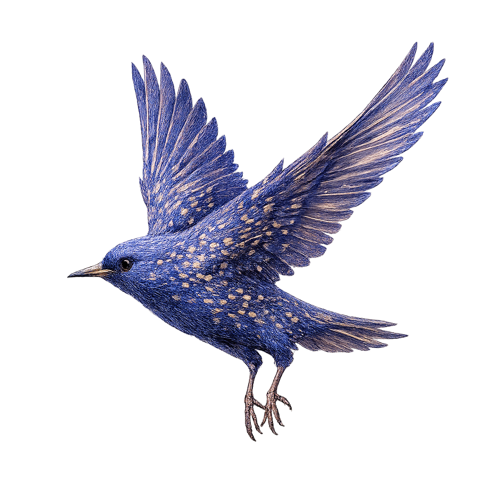
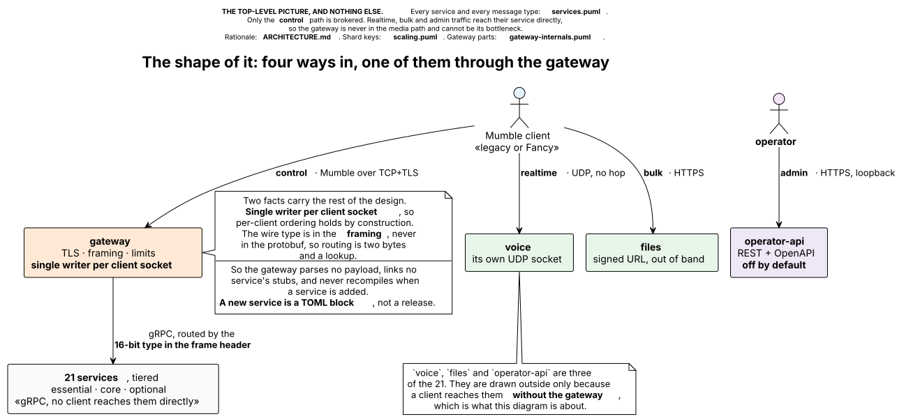

# Starling

A pure-Rust Mumble server, the replacement for `vendor/server` (C++/Qt murmur,
Fancy fork).

Starlings fly in *murmurations*, which keeps the name in the Mumble/Murmur
family, and describes the job.

The bird is Sterling. One letter off the project, and by the usual etymology
"little star", after the star struck on early Norman pennies.

**A gateway in front, independent gRPC services behind it, and media planes that
bypass the gateway entirely.** Architecture:
[`docs/ARCHITECTURE.md`](docs/ARCHITECTURE.md). Wire compatibility:
[`docs/PROTOCOL-COMPATIBILITY.md`](docs/PROTOCOL-COMPATIBILITY.md). Config:
[`docs/CONFIGURATION.md`](docs/CONFIGURATION.md). Storage:
[`docs/STORAGE.md`](docs/STORAGE.md). Diagrams:
[`docs/diagrams/`](docs/diagrams/).

How far the port has got, measured against two different targets:
[`docs/GAP-ANALYSIS.md`](docs/GAP-ANALYSIS.md) against upstream murmur, and
[`docs/FANCY-PARITY.md`](docs/FANCY-PARITY.md) against the Fancy fork. A feature
can be done by one measure and missing by the other, so neither file answers
the question on its own.

## Install

The [latest release](https://github.com/Fancy-Mumble/starling/releases/latest)
has a build for each platform — `.deb`, `.rpm` and `.AppImage` for Linux, a
`.dmg` for macOS, an `.exe` for Windows, and a `.tar.gz`/`.zip` for anything
else. Run it, and it writes its own configuration, creates the SuperUser account
and prints the password:

```text
==============================================================================
  STARLING 0.2.0   |   FIRST START
==============================================================================

  Administrator
    user            SuperUser
    password        vSqAZ3aaSyHMHGNu9DK4
  ...
```

Then point a Mumble client at `localhost:64738`. Where the configuration and the
databases land, and what the packages install, is in
[`docs/RELEASING.md`](docs/RELEASING.md#downloadable-builds).

For a container, `ghcr.io/fancy-mumble/starling`; for a cluster,
[`deploy/helm/starling`](deploy/helm/starling/README.md).

## Quick start

```sh
# One process, every service, in-memory transports between them.
cargo run --bin starling -- --all-in-one

# One service, as Kubernetes runs it.
cargo run --bin starling -- text --config starling.toml

# Convert an existing murmur config.
cargo run --bin starling -- migrate-config /path/to/mumble-server.ini > starling.toml

# Move an existing murmur server across: channels, accounts and their
# passwords, ACLs and groups, bans, listeners. It reads murmur's database
# without writing to it, so the old server keeps working either way.
cargo run --bin starling -- migrate-db --from sqlite:/path/to/murmur.sqlite --dry-run
```

`migrate-db` prints what it would move and what it could not carry, and writes
nothing until `--dry-run` is dropped; `--verify` re-reads both sides afterwards
and says whether they agree. murmur numbers its virtual servers from zero and
Starling's shipped deployment has instance 1, so a single-server migration is
usually `--server-id 0 --instance 1`.

With no `--config`, Starling uses this platform's own configuration directory
and writes a starter file there the first time it runs — except in a directory
that already holds a `starling-data/`, which keeps the built-in defaults it has
always had, so an existing deployment is left exactly where it is. Either way a
self-signed certificate is generated on first boot and kept in the data
directory. Mumble clients identify a server by certificate fingerprint, so
keeping that directory keeps the server's identity stable across restarts.

A configuration file overlays those defaults rather than replacing them, so it
carries only what you are changing:

```toml
[[instances]]
name = "Frog Pond"
port = 64738

[instances.settings]
max_users = 20
password  = "hunter2"
```

[`starling.example.toml`](starling.example.toml) is the file to copy;
[`examples/advanced/`](examples/README.md) has the knobs you should not need,
one file each, pulled in with `include`.

**Linux, macOS and Windows.** Services on one host reach each other over the
platform's own local IPC, a Unix domain socket or a named pipe on Windows,
and the built-in defaults pick whichever this build can serve, so the quick
start above needs no configuration file on any of the three. A hand-written
`unix:` endpoint is a startup error on Windows rather than a substitution: the
two are different permission boundaries and only one exists per build.
[`docs/CONFIGURATION.md`](docs/CONFIGURATION.md#endpoints) has the table.

## In containers

One image, one entrypoint, and `command` decides which service a container is.
[`docker-compose.yml`](docker-compose.yml) is the deployment of
`docs/ARCHITECTURE.md`: 22 containers by default, the 21 services plus the
gateway, configured by [`deploy/starling.toml`](deploy/starling.toml).

```sh
docker compose up -d --wait --build                  # build, start in tier order, block
docker compose --profile admin up -d --wait --build  # ... plus operator-api, on loopback
docker compose up -d --wait --build starling         # instead: one container, in-process
```

Keep the `--build`. Compose builds only when the image is *missing*, so a stale
`starling:local` is reused however far the source has moved. Every container
runs the same binary picked by `command`, so that failure surfaces as a service
exiting with `no service named "..."`, which says nothing about the image.

Then connect a Mumble client to `localhost:64738`. `--wait` returns once every
container is healthy, and health here is a TCP connect: this build has no HTTP
`/healthz` to probe, so it means the listener is up, not that the caches are
warm.

## The shape of it

<picture>
  <source media="(prefers-color-scheme: dark)" srcset="docs/diagrams/shape-dark.svg">
  <source media="(prefers-color-scheme: light)" srcset="docs/diagrams/shape.svg">
  
</picture>

Source: [`docs/diagrams/shape.puml`](docs/diagrams/shape.puml). Control is
Mumble-over-TCP and is brokered; realtime, bulk and admin traffic reach their
service directly, so the gateway is never in the media path and cannot be its
bottleneck.

The gateway is the **single writer to each client socket**, so per-client
ordering holds by construction. And the wire type is in the **framing, not the
protobuf**, so routing is two bytes and a lookup: it parses no payload, links no
service's stubs, and never recompiles when a service is added. A new service is
a TOML block.

## Crates

| Crate                   | What it is                                                                                                                                            |
| ----------------------- | ----------------------------------------------------------------------------------------------------------------------------------------------------- |
| `starling-proto`        | Upstream `Mumble.proto`: framing, message ids, version encodings. Upstream's surface plus the Fancy 1000+ fields, headed for upstream's file verbatim |
| `starling-proto-fancy`  | One envelope per service (types 1000+), and the inter-service gRPC contracts                                                                          |
| `starling-gate`         | What a peer is allowed to be given, by announced Fancy version                                                                                        |
| `starling-crypto`       | Voice ciphers, TLS identity, suite negotiation                                                                                                        |
| `starling-runtime`      | The one common crate: config, serving, health, drain, telemetry, storage, the client plane                                                            |
| `starling-gateway`      | The only component that holds a client's socket                                                                                                       |
| `crates/services/*`     | Twenty-one services, tiered in `docs/ARCHITECTURE.md` §4 (`operator-api` has a tier too, but its own crate)                                            |
| `starling-directory`    | Outbound only: the hourly announcement to the public Mumble server list                                                                               |
| `starling-operator-api` | The admin plane: REST + OpenAPI, pluggable auth, fail-closed audit                                                                                    |
| `starling-migrate`      | murmur `.ini` → `starling.toml`                                                                                                                       |
| `starling`              | One image, one entrypoint: a service name, or `--all-in-one`                                                                                          |

## Services and tiers

`tier` is not documentation, the gateway reads it and behaves accordingly.

| Tier          | Services                                                                                                                     | Down means                            |
| ------------- | ---------------------------------------------------------------------------------------------------------------------------- | ------------------------------------- |
| **essential** | session-lifecycle, session-view, permissions, metadata, userdata, server-config                                              | reject logins                         |
| **core**      | voice, text, pchat, moderation                                                                                               | that feature is dead; the server runs |
| **optional**  | screenshare, files, plugins, push, audit, onboarding, social, link-preview, context-actions, directory, health, operator-api | nobody notices                        |

The gateway's own tier is `core`, which it never consults. A tier says what the
gateway does while a service is unhealthy.

## Quality gates

Run after every logical task, not at the end of the day:

```sh
cargo fmt --all
cargo clippy --workspace --all-targets -- -D warnings
cargo test --workspace --all-targets
cargo test --workspace --doc
```

Before pushing:

```sh
cargo deny check advisories bans licenses sources
scripts/check-proto-drift.sh           # our trees agree with each other
python3 scripts/check-proto-hygiene.py # ...and none of them breaks its own rules
python3 scripts/check-proto-compat.py  # ...and we still match real upstream Mumble
```

Each check is blind where the next one looks. The drift check compares our
trees, so it catches one that fell behind but never a rule all of
them break identically. Both such rules did, see
[`docs/PROTOCOL-MIGRATION.md`](docs/PROTOCOL-MIGRATION.md) M6. Hygiene covers
those. Neither compares against Mumble itself, so neither can see a break with a
released client; compat reads `mumble-voip/mumble` from the `upstream` remote in
`vendor/server` and is the only one that can.

Lint configuration is deliberately mirrored from `vendor/client` and
`vendor/server/3rdparty/mumble-plugin-host`; keep the three in sync.
