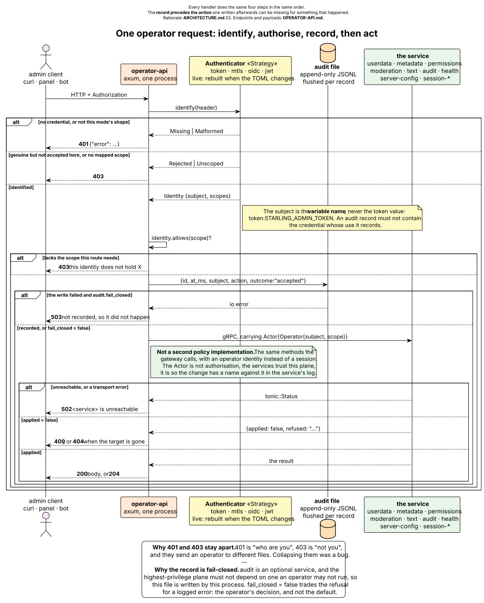
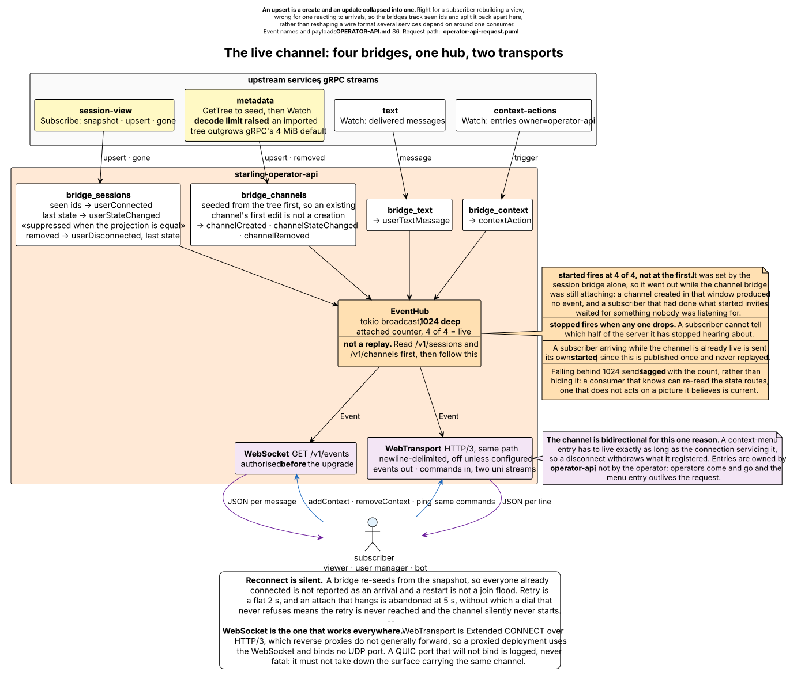

# The operator API

`operator-api` is the admin plane: plain HTTP with an `OpenAPI` description,
replacing Ice. It creates accounts, rewrites ACLs, bans, moderates live
sessions, reads settings and carries a live event channel.

This document is the surface. Rationale is
[`ARCHITECTURE.md`](ARCHITECTURE.md) §3 and TOML is
[`CONFIGURATION.md`](CONFIGURATION.md) "The admin plane".

---

## 1. Reaching it

Off by default, and bound to loopback when on:

```toml
[services.operator-api]
enabled = true
listen  = "127.0.0.1:8081"
```

```sh
docker compose --profile admin up -d --wait
curl -sX POST -H "Authorization: Bearer $STARLING_ADMIN_TOKEN" \
     localhost:8081/v1/whoami
```

Two routes take no credential:

| Route | Answer |
|---|---|
| `GET /healthz` | `ok\n`. Liveness only; server health is `GET /v1/health` |
| `GET /openapi.json` | The `OpenAPI` 3.1 description, path by path, with the scope each operation needs |

Everything under `/v1` is authenticated, `/v1/health` included: readiness names
internal services and the caches they wait on, which is a map of the deployment.

## 2. Authentication

The credential arrives in `Authorization`, whatever the mode.

| Mode | Header | Verified by |
|---|---|---|
| `token` | `Bearer <value>` | this process, against the configured token set |
| `mtls` | the certificate subject **verbatim**, no `Bearer` prefix (`Authorization: CN=admin-console`) | the TLS terminator in front, which is the only thing that has seen the chain |
| `oidc` | `Bearer <jwt>` | **nothing yet** |
| `jwt` | `Bearer <jwt>` | **nothing yet** |

**`oidc` and `jwt` refuse every request.** The JWKS client is not built, and a
surface that accepted unverified tokens would be worse than one that is closed.
Both log the refusal at warn. Use `token` or `mtls` until it lands.

A `token` identity is named after the *environment variable*, never the value:
`token:STARLING_ADMIN_TOKEN`. An audit record must not contain the credential
whose use it records.

The strategy is reloaded when `[services.operator-api.auth]` changes; a leaked
token stops working without a restart. A configuration the factory refuses
leaves the previous strategy in force and is logged.

### Scopes

An identity holds a list. `*` is everything, and a trailing `*` is a prefix
match, so `userdata:*` covers `userdata:read`.

| Scope | Unlocks |
|---|---|
| `userdata:read` | read accounts, avatars, comments |
| `userdata:write` | register, edit, delete accounts; set avatars and comments |
| `metadata:read` | the channel tree |
| `metadata:write` | create, edit, remove channels |
| `permissions:read` | channel ACLs, effective permissions |
| `permissions:write` | replace an ACL, grant temporary group membership |
| `moderation:read` | list bans |
| `moderation:write` | ban, unban, kick |
| `session-view:read` | list sessions, subscribe to `/v1/events` |
| `session:write` | move, mute, deafen, suppress, promote a live session |
| `server-config:read` | read settings, read `/v1/health` |
| `server-config:write` | change settings |
| `text:write` | send a server message |
| `audit:read` | query the audit service's log |

`POST /v1/whoami` demands the literal scope `*`; a narrowly scoped identity gets
403 from it. It is a check that a `*` credential works, not a general
introspection route.

## 3. What every request does

<picture>
  <source media="(prefers-color-scheme: dark)" srcset="diagrams/operator-api-request-dark.svg">
  <source media="(prefers-color-scheme: light)" srcset="diagrams/operator-api-request.svg">
  
</picture>

Source:
[`diagrams/operator-api-request.puml`](diagrams/operator-api-request.puml). The
record is written before the action, because one written afterwards can be
missing for an action that happened, and it reaches the disk before the call
returns.

| Status | Means |
|---|---|
| `200` | a body follows |
| `204` | applied, nothing to return |
| `400` | the request is malformed: nothing to change, a bad hex hash, an empty password, a ban matching nothing |
| `401` | no credential, or one that is not the shape this mode expects |
| `403` | a credential this server does not accept, one carrying no mapped scope, or one lacking the scope this route needs |
| `404` | no such account, session or ban |
| `409` | the target exists and the change was refused: a name already taken, an ACL rejected, a ban that did not apply |
| `502` | the service behind this route is unreachable, or answered with a transport error |
| `503` | the action could not be recorded, so it did not happen (`audit.fail_closed`) |

Errors carry `{"error": "..."}`. 401 and 403 stay distinguishable on purpose:
401 is "who are you", 403 is "not you", and they send an operator to different
files.

Every route addresses server instance `1`. Multi-tenancy is a deployment shape
Starling supports and this API has never exposed; `PUT /v1/accounts/{id}` alone
takes an `instance` field.

## 4. Endpoints

### Accounts

| Route | Scope | Answer |
|---|---|---|
| `GET /v1/accounts` | `userdata:read` | `[{id, name, email, cert_hash}]` |
| `POST /v1/accounts` | `userdata:write` | the created account |
| `PUT /v1/accounts/{id}` | `userdata:write` | the updated account |
| `DELETE /v1/accounts/{id}` | `userdata:write` | `204`, idempotent: an id that is not there is not `404` |

`?name=` is an exact lookup and `?prefix=` a scan; they are different questions,
and resolving a known username must not depend on no other account sharing its
opening characters. A `?name=` miss is `[]`, not `404`: this is a collection, and
"no account is called that" is an answer about its contents — as is a `?name=`
against a `userdata` that is down, which also reads `[]` rather than `502`. A
bare list returns at most 200 accounts and takes no cursor.

`cert_hash` is SHA-1 as lowercase hex, the form murmur prints and a Mumble
client's certificate dialog shows. Empty when none is registered.

```sh
curl -sX POST localhost:8081/v1/accounts -H "$AUTH" \
     -d '{"name":"ada","email":"ada@example.org","password":"..."}'
```

A `PUT` writes only the fields present, so two operators changing different
settings do not overwrite each other:

| Field | Notes |
|---|---|
| `password` | absent leaves it alone; present-but-empty is `400`, not a login any password opens |
| `name`, `email` | replaced as given |
| `cert_hash` | hex, even length, or `400`. `""` clears it. Registering it ahead of time is how a user is issued a certificate to import rather than having to connect with one first |
| `instance` | which server instance; defaults to `1` |

Sending no field at all is `400`. A missing id is `404`, checked before the
write, because `userdata` reports both a missing account and a refused change as
`permission_denied` and an operator cannot act on "denied".

**The SuperUser is account `0`**, so setting its password is
`PUT /v1/accounts/0 {"password":"..."}`. There is deliberately no separate
route; one would be this endpoint with a hard-coded id and would drift. The
account has to exist: `userdata` creates it on first boot, but a database
restored from before that needs `starling set-superuser-password`.

### Avatars and comments

Content-addressed blobs behind an account, not fields on it, and bytes do not
belong in a JSON field.

| Route | Scope | Body |
|---|---|---|
| `GET /v1/accounts/{id}/texture` | `userdata:read` | `application/octet-stream`, `404` when unset |
| `PUT /v1/accounts/{id}/texture` | `userdata:write` | raw bytes; empty clears |
| `DELETE /v1/accounts/{id}/texture` | `userdata:write` | `204` |
| `GET /v1/accounts/{id}/comment` | `userdata:read` | `text/plain`; absent reads as `""` |
| `PUT /v1/accounts/{id}/comment` | `userdata:write` | raw text |

A texture is served as octet-stream, not `image/png`: the bytes are whatever was
uploaded, and murmur's legacy texture format is zlib-compressed BGRA rather than
an image at all. An absent comment is an empty one, because no caller could do
anything different on `404` except write the same branch back to `""`.

The blob is stored before the account points at it, so a failure between the two
leaves an unreferenced blob rather than an account pointing at bytes that were
never written.

### Channels

| Route | Scope | Answer |
|---|---|---|
| `GET /v1/channels` | `metadata:read` | `{version, channels:[...]}` |
| `POST /v1/channels` | `metadata:write` | `{version, channel}` |
| `PUT /v1/channels/{id}` | `metadata:write` | `{version, channel}` |
| `DELETE /v1/channels/{id}` | `metadata:write` | `204` |

A channel reads as:

```json
{"id":3,"parent":0,"name":"General","description":"","position":0,
 "max_users":0,"links":[],"hidden":false,"temporary":false,
 "detached":false,"created_at_ms":1750000000000}
```

`hidden`, `temporary` and `detached` are unpacked from the wire bitfield so a
client need not know the layout. `detached` matters because `parent` is `0` for
both a detached channel and one truly at the root, and a caller building a tree
has no other way to tell a meeting room from the server's root.

**The tree is not visibility-filtered**, the same property Ice's `getChannels`
had. This plane answers for the server, not for a session, so there is no viewer
whose permissions could filter it. Filter by a user's `SeeChannel` yourself; the
`hidden` flag is surfaced for exactly that.

`POST` takes `name`, and optionally `parent` (`0`, the root, when omitted),
`description`, `position`, `max_users`, `temporary` and `invitee_user_ids`.
Naming invitees makes it a private room: `@all` is denied see, enter and
traverse, and each listed account is granted them. Creating a channel whose name
is taken is `409`, never a silent hand-back of somebody else's room.

`PUT` writes only the fields named, out of `name`, `description`, `parent`,
`position`, `max_users`. None named is `400`.

### ACLs and groups

| Route | Scope | Answer |
|---|---|---|
| `GET /v1/channels/{id}/acl` | `permissions:read` | `{inherit, acls:[...], groups:[...]}` |
| `PUT /v1/channels/{id}/acl` | `permissions:write` | `204` |
| `POST /v1/channels/{id}/groups/{group}/members` | `permissions:write` | `204` |
| `DELETE /v1/channels/{id}/groups/{group}/members` | `permissions:write` | `204` |

An ACL is read and written whole, unlike the field-list updates elsewhere: the
entries are ordered and evaluated as a sequence, so "change entry 3" is not a
well-defined request. Read it, edit it, write it back.

`grant` and `deny` stay numeric `Perm` bit sets. Names would put a translation
table in three places, and the numbers are what murmur's ACL editor, the wire
protocol and the database already use.

Entries carrying `inherited: true` are shown on a read so an operator sees the
effective set, and **dropped on a write**: writing one back would copy an
ancestor's rule into this channel, where it would then stop tracking the
ancestor.

A group membership request names exactly one of `account` or `session`; both, or
neither, is `400`. The distinction is the feature: an `account` grant lasts
until removed, and a `session` grant is the only way to put an **unregistered**
user in a named group, since permanent membership is keyed by account id and a
guest has none. **Neither is durable** — upstream says so of its own, and a
session-scoped grant surviving a restart would attach to whoever connects next
under that session id.

### Sessions

| Route | Scope | Answer |
|---|---|---|
| `GET /v1/sessions` | `session-view:read` | `{version, users:[...]}` |
| `PATCH /v1/sessions/{session}` | `session:write` | the applied state |
| `POST /v1/sessions/{session}/kick` | `moderation:write` | `204` |
| `GET /v1/sessions/{session}/permissions` | `permissions:read` | effective permissions |

A user reads as `{session, name, channel, user_id, mute, deaf, self_mute,
self_deaf, suppress, priority_speaker, connected_at_ms}`. `user_id` is `null`
for an unregistered guest, never `0`: account `0` is the SuperUser, and a guest
written as `0` would read as the administrator.

`PATCH` is the only route here that reaches a live connection. It is a partial
update — omitted means "leave it alone" — because a `PUT` could not express that
without the caller restating the user's whole state and racing whoever else is
changing it. Fields: `channel`, `mute`, `deaf`, `suppress`, `priority_speaker`.

```sh
curl -sX PATCH localhost:8081/v1/sessions/42 -H "$AUTH" \
     -d '{"mute":true,"channel":3}'
```

The answer is the **applied** state, which is not always what was asked:
deafening also mutes. A vanished session is `404` and a refused change is `409`,
because the recourse differs — retry elsewhere, or fix the ACL.

`kick` takes an optional `{"reason":"..."}`; murmur allows a bare kick.

`permissions` is murmur's `effectivePermissions`, and its `hasPermission` when
`?permission=` names one bit. One route, because the second is the first plus a
mask test and two routes could disagree. `?channel=` selects the channel,
default `0`.

```json
{"session":42,"channel":3,"granted":903,"groups":["all","auth"],
 "permission":4,"allowed":true}
```

The session is resolved through `session-view` and nowhere else. Letting a
caller assert an identity would make this a way to ask "what could this other
user do" and get an answer shaped by the lie.

### Bans

| Route | Scope | Answer |
|---|---|---|
| `GET /v1/bans` | `moderation:read` | `[{id, name, reason, start_ms, duration_s}]` |
| `POST /v1/bans` | `moderation:write` | `204` |
| `DELETE /v1/bans/{id}` | `moderation:write` | `204` |

A ban matches on any of three things, so all three are optional individually:

| Field | Notes |
|---|---|
| `address` | dotted-quad or IPv6 literal; anything else is `400` |
| `prefix_len` | how much of `address` to match; defaults to all of it |
| `cert_hash` | hex |
| `name` | matched as stored |
| `reason` | free text |
| `duration_s` | absent or `0` is permanent, as in murmur's `BanTable` |
| `session` | a connected session to drop as part of the ban |

A ban naming none of `address`, `cert_hash` or `name` is `400`, never stored: it
would sit in the list looking like protection and catch nobody. Lifting a ban
that is not there is `404` — the state asked for, but saying so is what tells an
operator their id was wrong.

The list omits `address`, `prefix_len` and `cert_hash`; a ban's match criteria
cannot currently be read back through this API.

### Messages

`POST /v1/messages`, scope `text:write`. The server addressing connected users,
which is the one thing an external system cannot do by holding a client
connection of its own.

```json
{"sessions":[42], "channels":[3], "tree":false, "body":"...", "store":false}
```

`tree` extends `channels` to their subtrees; `store` puts the message in
history. An empty or unaddressed message is `400`. Nobody connected is
**reported, not refused** — `{"delivered":false,"reason":"..."}` — because a
notice to an offline user is a normal outcome and the caller may want to fall
back to email.

### Settings

| Route | Scope | Answer |
|---|---|---|
| `GET /v1/config` | `server-config:read` | the settings snapshot |
| `POST /v1/config` | `server-config:write` | `204` |

Settable: `welcome_text`, `password`, `max_users`, `max_bandwidth`,
`text_message_length`, `image_message_length`, `channel_nesting_limit`,
`channel_count_limit`, `listeners_per_channel`, `listeners_per_user`,
`log_days`, `users_per_channel`, `default_channel`, `remember_channel`,
`remember_channel_duration`, `message_limit`, `message_burst`,
`plugin_message_limit`, `plugin_message_burst`, `allow_html`,
`allow_recording`, `broadcast_listener_volume_adjustments`, `cert_required`,
`obfuscate_ips`, `allow_ping`, `channel_name_regex`, `user_name_regex`,
`registry_name`, `registry_password`, `registry_url`, `registry_hostname`,
`registry_location`.

The mapping lives in `starling_runtime::settings` beside the defaults and the
field-wise merge, so a setting added there is settable here without a second
edit and the two cannot disagree about a name.

Three asymmetries to know:

* **Neither password is readable.** `password` and `registry_password` are
  settable and absent from `GET`: a credential read back is a credential in a
  log, a browser cache and whatever proxy sits between.
* **Six more are write-only** — `users_per_channel`, `default_channel`,
  `remember_channel`, `remember_channel_duration`, `channel_name_regex`,
  `user_name_regex`. `GET` does not return them.
* **An unrecognised key is not an error.** It is carried into the snapshot's
  `extra` map, which is how a service adds an operator-facing knob without a
  proto release — and also how a typo is accepted silently. A *known* key with
  the wrong JSON type is ignored and logged at warn; a body in which every key
  was ignored is `400`.

Changes are live. A setting an operator changes here outranks the file, and
`server-config` publishes it to every subscriber rather than waiting for a
restart.

### Health

`GET /v1/health`, scope `server-config:read`. The route a dashboard polls.

It is a read of a snapshot, not a sweep: the `health` collector polls every
service once every few seconds for everybody, so ten viewers cost what one does.
`observed_at_ms` comes with the answer, so a stale picture is visibly stale.

```json
{"state":"ready","observed_at_ms":1750000000000,"interval_ms":5000,
 "history":[{"observed_at_ms":...,"state":"ready","ready":21,"warming":0,
             "warning":0,"unreachable":0,"worst_latency_us":812,
             "slowest":"metadata","busiest_percent":4,"busiest":"text",
             "rejected":0}],
 "disabled":[],
 "services":[{"service":"userdata","state":"ready","latency_us":140,"error":"",
              "gates":[{"name":"schema","state":"ready"}],
              "load":[{"name":"inflight","used":0,"peak":3,
                       "capacity":64,"rejected":0}]}]}
```

`state` is one of `ready`, `warming`, `warning`, `unreachable`, `unknown` — the
name, not the wire number. History arrives in the same round trip because a
dashboard needs both the detail of now and the shape of the last hour, and two
polls would double the traffic to draw one page. It is best effort: a collector
that answers `Get` but not `History` yields an empty series rather than failing
the page.

`worst_latency_us` and `latency_us` are microseconds, unrounded, because
rounding at the source destroys the difference between "fast" and "not
measured". `capacity: 0` means nothing declares a limit, so show `used` and
`peak` as counts and invent no percentage.

### The audit log

`GET /v1/log`, scope `audit:read`. murmur's `getLog`, served from the `audit`
service's store.

| Query | Meaning |
|---|---|
| `since_ms`, `until_ms` | the window |
| `category` | one log category |
| `account` | the target account |
| `limit` | how many entries |

```json
[{"id":"0197...","at_ms":1750000000000,"category":"moderation",
  "action":"ban","actor_name":"ada"}]
```

**This is not the operator audit file** (§5). This route reads what the `audit`
service recorded about the server; the file records what operators did to it.

`getLogLen` has no counterpart: it exists upstream so a client can page by
offset, and paging by offset over an append-only log re-reads rows that shifted
underneath it. The service takes a `before` cursor, but this route does not yet
expose it — page by narrowing `until_ms`.

## 5. Audit is fail-closed

Every operator action is recorded before it happens, and a request is refused if
it cannot be recorded. `operator-api` writes this file itself rather than
calling the `audit` service, because `audit` is optional and the
highest-privilege plane must not depend on a service the operator may not be
running.

One JSON object per line, flushed per record — an action still in a page cache
when the process dies was not recorded, and fail-closed would be a lie:

```json
{"id":"0197...","at_ms":1750000000000,"subject":"token:STARLING_ADMIN_TOKEN",
 "action":"PUT /v1/accounts/0","outcome":"accepted"}
```

`outcome` is `accepted`, meaning the request was admitted, not that it
succeeded; the record precedes the work. What the service made of it is in the
service's own log, which is why every write also carries the operator identity
as its `Actor` — an operator action appearing in the audit file and nowhere else
is only half recorded.

`fail_closed = false` trades the refusal for a logged error and is the
operator's decision, not the default. It is read per request, so a `503` from an
unwritable log is the policy working. Changing the path or the policy needs a
restart; only the auth strategy reloads.

## 6. The live channel

`GET /v1/events`, scope `session-view:read`. What changed, as it changes — one
stream instead of polling every route above.

<picture>
  <source media="(prefers-color-scheme: dark)" srcset="diagrams/operator-api-events-dark.svg">
  <source media="(prefers-color-scheme: light)" srcset="diagrams/operator-api-events.svg">
  
</picture>

Source: [`diagrams/operator-api-events.puml`](diagrams/operator-api-events.puml).

Authorisation happens **before** the upgrade. A socket that opens and closes on
the first frame is, to most clients, indistinguishable from a network fault, and
an operator debugging a bad token deserves a 401.

### Events

Each frame is one JSON object tagged with `event`. The names are the C++
server's `ServerCallback` method names: nothing here speaks Ice, but the systems
being pointed at this channel were written against those names, and a
gratuitously different vocabulary would make each of them rewrite a `switch` to
gain nothing.

| `event` | Payload | Fires when |
|---|---|---|
| `userConnected` | `user` | a user finished connecting |
| `userStateChanged` | `user` | they moved, were renamed, muted, deafened or suppressed |
| `userDisconnected` | `user` | they left; the payload is their last known state, since nothing can look them up afterwards |
| `userTextMessage` | `user`, `message` | a message was delivered |
| `channelCreated` | `channel` | a channel was created |
| `channelStateChanged` | `channel` | it was renamed, moved, or had its description or limits changed |
| `channelRemoved` | `channel` | it and its subchannels were removed |
| `contextAction` | `action`, `owner`, `actor_session`, `session`, `channel` | a user chose a context-menu entry registered over this channel |
| `started` | `server_id` | the state below the bridges became readable |
| `stopped` | `server_id` | it stopped being readable |

`user` is the shape `GET /v1/sessions` serves, and `channel` the shape
`GET /v1/channels` serves minus `created_at_ms`. On `userTextMessage` the user
is only what `text` knows of the sender — `session`, `name`, `channel`,
`user_id` — and the remaining flags read false; join on `session` for the rest.
A `message` is
`{body, channels, sessions, tree, sent_at_ms, from_client}`; `from_client` is
false when the server itself sent it through `POST /v1/messages`, which a
watcher that reacts to messages needs so it does not answer its own
announcements.

Three more arrive from the transport rather than from the server's state:

| `event` | Payload | Means |
|---|---|---|
| `lagged` | `missed` | you fell more than 1024 events behind and lost the oldest. Re-read `/v1/sessions` and `/v1/channels` |
| `error` | `reason` | a command could not be parsed or was refused |
| `pong` | | answer to `ping` |

### Delivery rules

**It is a notification channel, not a replay.** A subscriber receives what is
published after it subscribes and nothing before. Read `/v1/sessions` and
`/v1/channels` first, then follow the stream.

**`started` means all four bridges hold a subscription**, and a subscriber that
connects while the channel is already live is sent its own `started` on arrival.
An earlier version set it from the session bridge alone, so `started` went out
while the channel bridge was still attaching and a channel created in that
window produced no event at all. `stopped` fires as soon as *any* bridge drops,
for the same reason: a subscriber cannot tell which half of the server it has
stopped hearing about.

**Upserts are split back apart.** `session-view` and `metadata` both publish an
upsert, which is a create and an update collapsed into one — right for a
subscriber rebuilding a view, wrong for one reacting to arrivals. This service
tracks which ids it has seen and reports `userConnected` against
`userStateChanged` accordingly, and suppresses a state event when nothing in the
projection actually changed.

**Reconnects are silent.** A bridge that re-attaches seeds itself from the
snapshot, so everyone already connected is not reported as an arrival and every
restart does not look like a join flood. Bridges retry every 2 s, and an attach
that hangs is abandoned after 5 s so the retry is actually reached.

### Commands

The channel is bidirectional, because registering a context-menu entry has to
end when the connection servicing it does: an entry whose owner has gone is a
menu item that does nothing. A disconnect withdraws everything that connection
registered, on either transport.

| `command` | Fields | Reply |
|---|---|---|
| `addContext` | `action`, `text`, `context` | `contextAdded` |
| `removeContext` | `action` | `contextRemoved` |
| `ping` | | `pong` |

```json
{"command":"addContext","action":"kick","text":"Kick","context":4}
```

`context` is a bitwise OR of the upstream bits: `1` server, `2` channel, `4`
user. The tag is `command`, not `action`, because `addContext` carries a field
called `action` already. An unparseable command is answered with `error` rather
than dropped — a command silently ignored looks exactly like one the server
chose not to honour.

Entries are owned by `operator-api`, not by the operator who added them:
operators come and go, and the menu entry outlives the request.

### WebTransport

The same channel over HTTP/3, at the same path, off unless configured:

```toml
[services.operator-api.webtransport]
enabled = true
listen  = "0.0.0.0:8443"
```

Identical JSON, so a consumer written against one transport reads the other
unchanged. Differences are mechanical:

| | WebSocket | WebTransport |
|---|---|---|
| Framing | one message per event | newline-delimited JSON |
| Direction | one socket | server-opened uni stream out, client-opened uni stream in |
| Credential | `Authorization` on the upgrade | `Authorization` on the CONNECT |
| Reachability | any reverse proxy | needs the deployment to terminate QUIC |

Two unidirectional streams rather than one bidirectional: a `BidiStream` sends
and receives on one object, so reading and writing it concurrently means a lock,
and a lock held across a write would stall event delivery whenever a command
arrived. Replies still go out on the event stream, so the consumer sees one
ordered sequence either way.

A UDP port that will not bind is logged, not fatal. It must not take down the
HTTP surface, which serves the same channel and is what a proxied deployment
uses anyway.

A refused credential here closes the session with no status line: the WebSocket
answers 401, WebTransport logs and hangs up. Check a token against
`POST /v1/whoami` before blaming QUIC.

## 7. Known limits

| | |
|---|---|
| `oidc`, `jwt` | refuse every request; no JWKS client |
| `POST /v1/whoami` | requires the literal `*` scope |
| `GET /v1/accounts` | 200 accounts, no cursor; `?name=` swallows a transport failure as `[]` |
| `GET /v1/bans` | omits `address`, `prefix_len`, `cert_hash` |
| `GET /v1/log` | no `before` cursor |
| `GET /v1/config` | six settable keys are not readable |
| `POST /v1/config` | an unknown key is accepted into `extra`, not rejected |
| Everything | server instance `1`, except `PUT /v1/accounts/{id}` |
