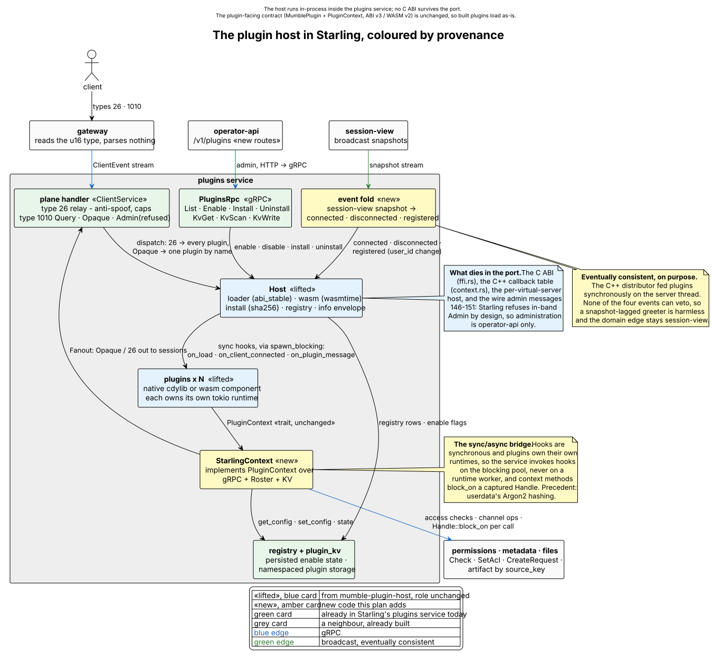

# Plugin host port plan

How the Fancy plugin host moves from the C++ server into Starling. Written
2026-08-20 against `vendor/server` @ the current e2e pin and Starling main.
Companion to `docs/FANCY-PARITY.md` §1, which names this the single
highest-leverage piece of work left.

## Status, 2026-08-20

**M0 through M3 are built and green; M4 is half done; M5 is open.** A plugin
binary is loaded, started, told about clients, and answers messages addressed to
it -- proven end to end against the real `mumble-friends` cdylib in
`crates/plugin-host/host/tests/loads_a_real_plugin.rs`, which loads it, watches
a client arrive, and asserts the reply comes back.

### The ABI claim, checked

§3 claims a plugin binary built against either tree loads in either server.
That is now tested rather than asserted:
`crates/plugin-host/host/tests/loads_the_published_examples.rs` loads all six
native plugins from
[fancy-plugin-example](https://github.com/Fancy-Mumble/fancy-plugin-example) --
`chat-card`, `feedback-form`, `gallery-showcase`, `greeter`, `info-card`,
`quick-poll` -- and every one of them was compiled against the **C++ server's**
copy of `mumble-plugin-api`, which is what that repository depends on by path.
Nothing rebuilt them against this tree's copy in between. All six load, name
themselves, advertise a parseable `info_json`, carry their slash commands
across, and receive a client-connected event.

The result is not vacuous, which was checked the only way it can be: bumping
this tree's `PLUGIN_ABI_VERSION` from 3 to 4 makes all six fail with
`has ABI version 3 but host expects 4`, and every test in that file goes red.
Two things have to hold for one of those binaries to load -- the exported
version probe matching, and `abi_stable`'s layout check passing on
`MumblePlugin`'s vtable, `PluginContext`'s, `ClientInfo` and `PluginError` --
and a field reordered or a method added fails the second with a layout error
rather than loading and misbehaving.

**The seventh example is not covered.** `greeter-wasm` is a WebAssembly
component built against `WASM_ABI_VERSION`, a separate constant on a backend
this host compiles out by default; proving it needs the `wasm32` target,
`wasm-tools`, and a build with `--features wasm-plugins`. The host does at
least refuse a `.wasm` file with a message naming the feature, rather than
scanning it and silently doing nothing.

What is *not* there, so nobody has to find out by trying:

- **Installing over the wire.** The host installs from bytes -- digest-checked,
  name-sanitised, rolled back on a bad load -- but nothing fetches the bytes:
  `files` exposes signed URLs and `Stat`, not a read, so this needs an HTTP
  client the service does not have. `Install` refuses with that reason. The
  working path is to put the binary in `plugins_dir` and enable it.
- **The operator routes.** Administration goes through `PluginsRpc` today;
  `/v1/plugins` on `operator-api` is not written, so an operator reaches it by
  gRPC rather than by REST.
- **The WASM backend.** Lifted behind `starling-plugin-host/wasm-plugins` and
  **off by default**, unlike the C++ server where it is on. wasmtime is a
  multi-minute build and no shipped plugin needs it yet. The loader refuses a
  `.wasm` file with a message saying which feature to turn on.
- **The five heavier plugins.** Only `friends` came across. `audit`, `calendar`,
  `file-server`, `link-preview` and `live-doc` are still in the C++ tree.
- **`provision_live_doc_bridge` is deliberately gone**, not overlooked. It
  hard-coded two plugin names in the host, which is what `docs/STORAGE.md` L6
  forbids. Live documents will not persist until something above the host grants
  that capability generically -- see open question 1, which this makes urgent
  rather than theoretical.

Two additive proto fields were needed and are in: `Opaque.payload_type`
(without it a plugin cannot tell one of its own messages from another, and
`friends` dispatches on exactly this) and `PluginDescriptor.info_json` (what a
client renders a plugin's manifest from). Both are new field numbers on proto3
messages, so nothing already on the wire changes meaning.

## 0. The good news: it is not a C++ port

The C++ server's plugin host is already Rust. `src/murmur/PluginHostManager.cpp`
is a ~800-line bridge; everything real lives in the Rust workspace at
`vendor/server/3rdparty/mumble-plugin-host/`:

- `host/` — discovery, `abi_stable` native loading (`loader.rs`), a wasmtime
  component backend (`wasm.rs`), marketplace install (`install.rs`), the
  `fancy-plugin-info` envelope (`info.rs`), and the `Host` state machine
  (`host.rs`).
- `api/` — the plugin-facing contract: `MumblePlugin` (the hook trait),
  `PluginContext` (what plugins call back into), permissions, client
  manifests. `PLUGIN_ABI_VERSION = 3`, `WASM_ABI_VERSION = 2`.
- `api-derive/`, `api-wasm/`, `wit/` — proc macros and the WASM guest SDK.
- Six shipped plugins: `audit`, `calendar`, `file-server`, `friends`,
  `link-preview`, `live-doc`.

Only two files in that workspace are C++-shaped and do not move:

- `host/src/ffi.rs` — the `extern "C"` surface for `PluginHostManager`. Dies.
- `host/src/context.rs` — `PluginHostCallbacks` (a C function-pointer table)
  plus `ScopedContext`. Replaced by a Starling-native `PluginContext` impl.

Everything the C++ side does beyond calling those entry points — event
subscription, wire-message handling for types 26/146–151/200/201, admin authz,
registry broadcast — Starling's `plugins` service either already does or has a
designated home for.

## 1. What Starling already has (terrain)

`crates/services/plugins/` (524 lines) owns:

- gRPC `PluginsRpc`: `List`, `Enable`, `Install`, `Uninstall`, `Deliver`,
  `KvGet/KvScan/KvWrite` (`plugins.proto`).
- Client plane: `PLUGIN_DATA` (26) relay with anti-spoof + caps, and outer
  type 1010 `PluginsEnvelope` (`Query`→`Registry`, `Opaque`→relay,
  `Admin`→refused as an operator action).
- Namespaced plugin storage: `runtime/src/storage/kv.rs` over the `plugin_kv`
  table, per `docs/STORAGE.md` §L5/L6.

What it lacks (verified: no `libloading`/`wasmtime`/`dlopen` anywhere under
`crates/`):

1. A loader. `Install` records a row; nothing is fetched, verified, or run.
2. Persistence — `installed: Mutex<HashMap>` forgets everything on restart.
3. A `Serve::run` task to own plugin lifetimes.
4. A lifecycle event feed — connect/disconnect/user-state never reach the
   plugins service (only `session-view` and operator-api's `EventHub` see
   them).
5. Operator routes — no `/v1/plugins`.
6. A `[services.plugins]` example config block.

## 2. Target architecture

The host lives **inside `PluginsService`**, in-process. No C ABI anywhere.

<picture>
  <source media="(prefers-color-scheme: dark)" srcset="diagrams/plugin-host-dark.svg">
  <source media="(prefers-color-scheme: light)" srcset="diagrams/plugin-host.svg">
  
</picture>

Source: [`diagrams/plugin-host.puml`](diagrams/plugin-host.puml).

Key inversions relative to the C++ integration:

- **Per-server → per-service.** The C++ side creates one host per virtual
  server. Starling runs one `Host` in the plugins service and keys plugin
  state by `server_id`, which the host's session map
  (`HashMap<(ServerId, SessionId), ClientInfo>`) already supports. Plugins
  see the same `server_id` parameter they see today.
- **Wire admin → operator admin.** The C++ server accepts plugin admin over
  the client wire (types 146–151, root-channel Write). Starling has already
  decided otherwise — the 1010 `Admin` envelope is refused by design. Admin
  goes through operator-api routes calling `PluginsRpc`. The 146–151 wire
  messages are *not* ported.
- **Callback table → trait impl.** `PluginContext` stays the plugin-facing
  trait, byte-for-byte compatible; only its implementation changes from
  C-trampolines-into-Qt to gRPC-and-runtime calls.

### Sync/async bridge

Plugin hooks are synchronous and plugins own their own tokio runtimes
(`api/src/lib.rs:7-14`). Starling handlers are async. The bridge:

- Hooks are invoked via `tokio::task::spawn_blocking` (precedent:
  `userdata/src/lib.rs:181` for Argon2). Never call a hook on a runtime
  worker.
- `StarlingContext` methods are sync (the trait demands it); each captures a
  `tokio::runtime::Handle` plus cached tonic clients and uses
  `Handle::block_on`. Callers are plugin worker threads or the blocking
  pool — both are legal places to block on a foreign runtime.
- The whole `Host` stays behind one `Mutex`, exactly like the reference
  (`ffi.rs:61`). Serialized dispatch was good enough for the C++ server;
  don't parallelize until something measures slow.

### Context method mapping

| `PluginContext` method | C++ implementation | Starling implementation |
|---|---|---|
| `send_plugin_message` | direct proto emit | `Fanout::push` of a 1010 `Opaque` (or 26) to target sessions; channel targets resolved via `Roster` |
| `send_plugin_data` (deprecated) | ditto | ditto, type 26 |
| `is_session_active` / `all_sessions` / `sessions_in_channel` / `find_session_by_name` / `current_channel` | `qhUsers` under `qrwlVoiceThread` read lock | `Roster` + session-view snapshot cache held by the service |
| `user_has_channel_access` / `has_permission` | `ChanACL::` checks | `permissions` gRPC `Check`/`SessionCheck` |
| `get_config` / (host-only) `set_config` | per-server DB + ini fallback | plugin KV under the reserved `__host` namespace, with `[services.plugins].options` as the seed a stored value overrides. The namespace is refused to `KvGet`/`KvWrite` callers, or a plugin could write `plugin.<other>.enabled` |
| `create_channel` / `grant_channel_access` / `revoke_channel_access` | `QMetaObject::invokeMethod` onto server thread | `metadata` gRPC `CreateRequest` + `permissions` `SetAcl`/`TemporaryGroup` |
| `send_request_response` | C++ handler registry (`m_responseHandlers`) | Rust closure registry inside `PluginsService` (same request/response bridge, no FFI) |

Nothing in the trait needs kick/ban/move — the C++ host never exposed them
either. If plugins later need moderation verbs, `moderation` and
`SessionControlGrpc::set_state` are one gRPC call away, behind a new
versioned trait method.

### Event feed

The C++ host subscribes to exactly four distributor events. Their Starling
sources:

| Event | C++ source | Starling source |
|---|---|---|
| `on_client_connected` | `onUserConnected` | session-view broadcast: session appears |
| `on_client_disconnected` | `onUserDisconnected` | session-view broadcast: session gone |
| re-`connected` on registration (`user_id` change) | `onUserStateChanged` + `m_lastUserId` | session-view diff on `user_id`, same last-seen map |
| `on_plugin_data` / `on_plugin_message` | wire 26 / 200 | plane `frame()`: 26 fans out to all loaded plugins; 1010 `Opaque` naming a *loaded* plugin dispatches to exactly that one, otherwise relays to clients as today |

operator-api's `events.rs` already does the snapshot→event diffing with the
right vocabulary. **Built as a second fold** (`plugins/src/events.rs`) rather
than shared: the two produce different shapes -- JSON for a websocket, an
ABI struct for a plugin -- and merging them would make one depend on the
other's vocabulary. Two folds is one more than there should be; worth
revisiting if a third appears. `fancy-plugin-info` ships to each session on its
connected event, unchanged wire format (`info.rs`: version byte, zstd bit,
64 KiB cap).

The fold has to *diff*, not replay. A re-subscription after `session-view`
restarts opens with a full snapshot, and replaying it would tell every plugin
the whole server just connected -- a greeter would greet everybody twice. The
same diff is what reports the clients that left while the stream was down and
never produced a `Gone`.

Note the semantics change worth accepting: session-view is eventually
consistent (broadcast snapshots), where the C++ distributor was synchronous
on the server thread. None of the four events is used for veto, so lag is
harmless; a cold roster just delays a greeter by milliseconds.

## 3. Moving the crates

**Done: moved into Starling** at `crates/plugin-host/`, holding `api`,
`api-derive`, `host`, `wit`, and `plugins/friends`. Rationale:
`vendor/server` is a frozen parity reference; Starling is where this code will
be maintained. The copy left behind in the C++ tree keeps that server building
but receives no new work. (The alternative, splitting `mumble-plugin-host` into
its own repo consumed by both, is more moving parts and only worth it if the
C++ server outlives the plan for it.)

`api-wasm` came across too, in a second pass, though nothing in Starling links
it: it is the *guest* SDK, what a WASM plugin is built against rather than
anything a host needs. It is here because leaving it behind meant a plugin
author still had to check out a C++ server to build a plugin for this one,
which is the tax the lift exists to end. A test in that crate holds its ABI
constant equal to the native crate's `WASM_ABI_VERSION`, since the two are
constants in separate crates that nothing else ties together.

The five heavier plugins did not come across; each needs evaluating against
Starling on its own terms (M5), and `friends` is the one that earns its place
now as the host's exit test.

### Who depends on the API

Starling is the maintained copy, and plugin authors take it from here, over git:

```toml
mumble-plugin-api = { git = "https://github.com/Fancy-Mumble/starling.git", branch = "main" }
```

That is what
[fancy-plugin-example](https://github.com/Fancy-Mumble/fancy-plugin-example)
does as of 2026-08-20, replacing a path dependency on a sibling checkout of the
C++ server. All seven of its plugins -- the six native ones and the WASM
component -- build with nothing checked out beside them, and its CI no longer
clones a server to build a plugin.

The C++ tree keeps its copy and still works; it is frozen. The two remain
semantically identical, the only differences being import ordering and line
wrapping from `cargo fmt`. Nothing enforces that, and nothing needs to while
one of them is not changing.

Editions differ on purpose: `api` and `api-derive` stayed on 2021 because they
are held to a published ABI and an edition migration is a change to it, while
`host` took the workspace's 2024 since nothing in it is ABI-bound. Both are
valid in one workspace. Each lifted crate also kept its own `[lints]` block
rather than `workspace = true`; Starling's set has denials the lifted code has
never been held to, and conforming it is a separate pass from moving it.

Compatibility invariants to hold while moving:

- **Crate names and ABI constants unchanged** (`mumble-plugin-api`,
  `PLUGIN_ABI_VERSION = 3`, `WASM_ABI_VERSION = 2`, root module name
  `fancy_plugin`, both exported symbols). Existing built plugin binaries
  must load in either server unmodified.
- **Toolchain**: both workspaces already pin Rust 1.95.0 — keep them in
  lockstep; `abi_stable` layout checks fail loudly on drift, but matching
  compilers avoid the churn.
- Keep the loader's two hard-won gotchas: the layout-independent
  `__mumble_plugin_abi_version` probe *before* any `abi_stable` cast
  (`loader.rs:193-201`), and `lib_header_from_path` instead of
  `RootModule::load_from_file` (the per-type static cache returns the
  first-loaded module for every later path, `loader.rs:225-240`). Also keep
  the Linux ELF pre-validation via `goblin`.

Workspace friction to resolve up front:

- `unsafe_code = "deny"` workspace-wide (`Cargo.toml:192`). The reference
  workspace has the same lint relaxed to `allow` only in the `host` crate;
  Starling does the same, with a reason string
  (`allow_attributes_without_reason` is deny).
- `panic = "abort"` in release (`Cargo.toml:285`): the host's
  `catch_unwind` guards are moot in release — a panicking native plugin
  aborts the server. The reference host ships with the identical posture,
  so this is parity, not regression. Treat native plugins as trusted
  first-party code; untrusted/marketplace code should be WASM. (If that
  ever hurts, the standalone plugins-service binary can be built with a
  `panic = "unwind"` profile override — per-unit deployment makes the blast
  radius one service.)
- Starling denies `missing_docs`, `unwrap_used`, `too_many_lines`,
  `excessive_nesting` — the lifted crates carry the same lints already, but
  expect a small conformance pass (edition 2024 migration included).

## 4. Milestones

**M0 — Lift. Done.** Crates moved as above, `ffi.rs` deleted, `context.rs`
reduced to the `ScopedContext` config scoping over the new `HostBridge` trait.
`cargo clippy --workspace --all-targets -D warnings` is green with the new
crates as members.

**M1 — Host in the service. Done.** `PluginsService::build` constructs the
`Host` on the blocking pool (loading runs `on_load`, which is arbitrary
blocking code and calls straight back through the bridge -- on a worker thread
that deadlocks rather than merely stalls). Configuration comes from
`[services.plugins].options`, persisted state from the KV `__host` namespace.
`RegistryQuery` answers from the real host and the registry is re-broadcast
whenever the loaded set changes.

**M2 — The bridge. Done.** The mapping table above, implemented in
`plugins/src/bridge.rs`: KV-backed config with the TOML block as its seed,
`Fanout` for both message shapes, `Roster` for every membership question,
`permissions` gRPC for the two checks, and `metadata` gRPC for channel create
and invitee grant/revoke -- with `reuse_existing`, so provisioning is
idempotent and a second attempt cannot overwrite the first one's ACL table.

**M3 — Events + dispatch. Done.** A `session-view` subscription folded into
both the roster and a presence diff, feeding connected / disconnected /
registration re-announce; `fancy-plugin-info` on connect; 26 fanned out to
every loaded plugin before it is relayed; 1010 `Opaque` dispatched to the one
plugin owning the name, and relayed between clients when none does.
`send_request_response` is still the trait's default no-op, because nothing
lifted so far uses the request/response bridge.

**M4 — Admin. Half.** `List`, `Enable`/disable and `Uninstall` go to the host,
with hot toggle, re-announce and registry broadcast, matching the C++ cycle.
Two pieces remain: `Install` needs something that can fetch `source_key` from
`files` (which exposes signed URLs and `Stat`, not a read) and hand the bytes to
`Host::install_plugin`, which is written and tested; and operator-api still has
no `/v1/plugins`, so administration is gRPC-only.

**M5 — Hardening + parity sweep.** Still open, minus one: the path-traversal
gap is **fixed** -- `install.rs` reduces a caller's name to a bare file name
before joining it, where the original took `cdylib_filename` out of an
attacker-writable manifest and joined it unsanitised, so an artifact could be
written anywhere the server could write. Remaining: WASM epoch deadlines (the
reference configures none, so a guest can spin forever), carrying over the fuzz
targets and `cargo-deny` config, and the config-change → disable/enable reload
cycle in Starling's hot-reload table (`config/reload.rs`). Exit: the shipped
plugins (`audit`? see open questions, `calendar`, `file-server`,
`link-preview`, `live-doc`) evaluated one by one against Starling.

Per FANCY-PARITY.md:168, the plugin layer is missing at both ends — M1–M4
alone won't green the client-visible e2e suites until the client side
exists too. `friends` + registry assertions are the honest server-side
exit tests.

## 5. Open questions (decisions wanted)

1. **Where the shipped plugins' feature bridges go. Now blocking, not
   theoretical.** The C++ server wires `link-preview` and `audit` through
   dedicated bridges (`LinkPreviewBridge`, `AuditLogBridge`) and hard-codes the
   live-doc↔file-server token handshake in the host
   (`provision_live_doc_bridge`). All three know a plugin by name, which
   STORAGE.md L6 forbids. **The live-doc bridge was dropped rather than lifted**,
   so the question is no longer "which option" but "what replaces it": live
   documents cannot persist without some way for one plugin to be granted a
   secret another plugin owns. Options unchanged: (a) a compat shim inside the
   plugins service, quarantined and documented as debt; (b) a generic capability
   a plugin declares in its manifest and the host grants. Recommendation is now
   (b) directly — (a) was only worth it to avoid a regression, and the
   regression has already been taken. Still to decide separately: whether
   Starling's `audit` *service* supersedes the `fancy-audit` plugin outright.
2. **Native backend: keep or WASM-only?** Settled: both. Native is built and is
   what every shipped plugin uses; WASM is lifted behind a feature that is off
   by default. Policy: native = first-party/builtin, WASM = everything
   installable. Turning the feature on and proving a component loads is its own
   piece of work.
3. **Move vs. share the crates** (§3). Settled: moved; the C++ tree keeps a
   frozen copy.
4. **`MUMBLE_PLUGIN_DIRS` / `MUMBLE_PLUGIN_LOG` env vars.** Settled for the
   first: `MUMBLE_PLUGIN_DIRS` is still honoured, adding to the configured
   directory rather than replacing it, because it is what a developer running
   one build against another tree's plugins reaches for. `MUMBLE_PLUGIN_LOG` is
   gone — plugins log through `tracing` into Starling's own telemetry, and a
   second filter nobody knows about is worse than none.
5. **Client-manifest settings surface.** Unchanged and still deferred. The C++
   server exposes each enabled plugin's `client_manifest.config_schema` as
   editable server settings and bumps a settings revision on toggle; Starling's
   equivalent would hang off `server-config`. The manifest itself now reaches
   clients (`PluginDescriptor.info_json`), so this is only about *editing* it.
