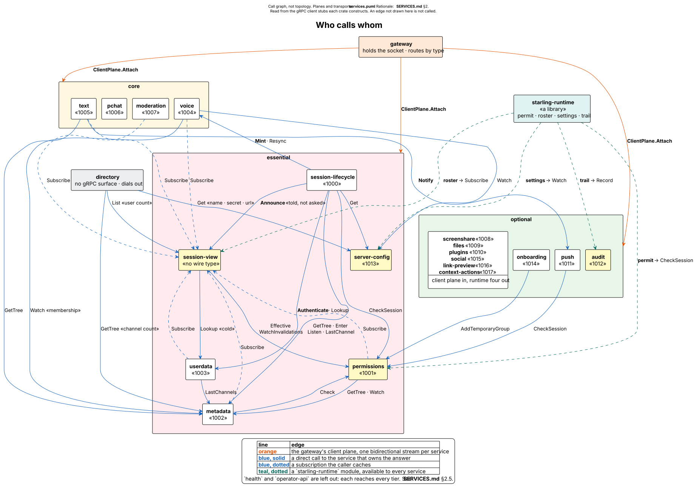
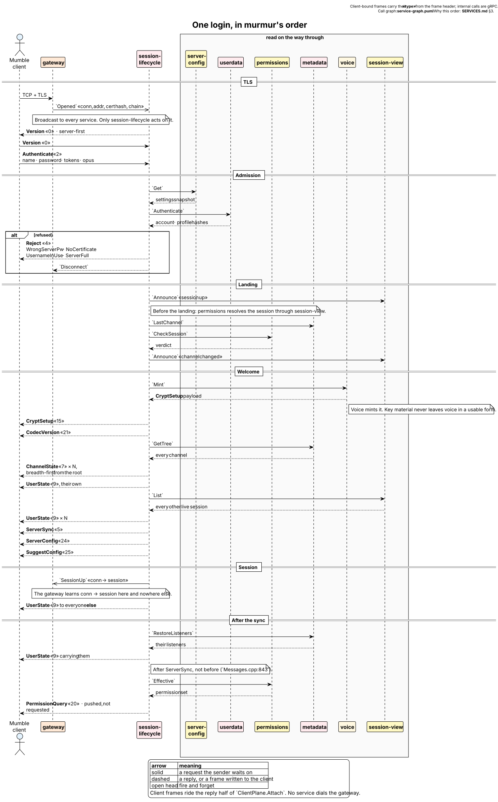
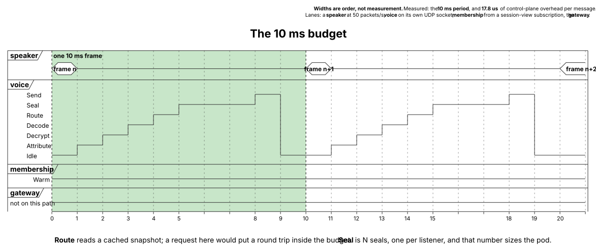

# Starling services

Twenty-one services, one gateway and one admin API. What each owns, what it
calls, and what calls it.

`ARCHITECTURE.md` argues the shape: why the gateway routes without parsing, why
audio takes no hop, why session is two services. This document is the reference
for the parts, and every edge in it was read out of the source rather than out
of a design note. Where the two disagree, this one is wrong until it is edited.

---

# 1. Who calls whom

<picture>
  <source media="(prefers-color-scheme: dark)" srcset="diagrams/service-graph-dark.svg">
  <source media="(prefers-color-scheme: light)" srcset="diagrams/service-graph.svg">
  
</picture>

Source: [`diagrams/service-graph.puml`](diagrams/service-graph.puml). For the
same components arranged by *plane and transport* instead — which of them a
client reaches over TCP, UDP, WebRTC or HTTPS — see
[`diagrams/services.puml`](diagrams/services.puml), rendered in the root
[`README.md`](../README.md#services-and-tiers).

Two callers are left off that picture because each reaches every tier and
neither says anything about the graph: `health` polls all of them on a timer,
and `operator-api` calls nine of them directly. Both are in §2.5.

## 1.1 Every service at a glance

`tier` is not documentation. The gateway reads it and behaves accordingly:
inbound traffic is shed by tier under pressure, and a dead **essential** service
means logins are refused rather than served on a guess.

| Service | Tier | Wire types | gRPC surface | Store | Calls |
|---|---|---|---|---|---|
| `session-lifecycle` | essential | 0, 2, 3, 4, 5, 9, 15, 21, 22, **1000** | `SessionControl` | — | userdata · voice · metadata · permissions · server-config · session-view |
| `session-view` | essential | *none* | `SessionView` | — | userdata · permissions |
| `permissions` | essential | 12, 13, 20, **1001** | `Permissions` | yes, optional | metadata · session-view |
| `metadata` | essential | 6, 7, **1002** | `Metadata` | yes | permissions · session-view |
| `userdata` | essential | 14, 18, 23, **1003** | `UserData` | yes | metadata · session-view |
| `server-config` | essential | 24, 25, **1013** | `ServerConfig` | yes | — |
| `voice` | core | 1, 19, **1004** | `Voice` | — | metadata · server-config · session-view |
| `text` | core | 11, **1005** | `Text` | yes | metadata · push · session-view |
| `pchat` | core | **1006** | *client plane only* | yes | — |
| `moderation` | core | 8, 10, **1007** | `Moderation` | yes | session-view |
| `screenshare` | optional | **1008** | *client plane only* | — | — |
| `files` | optional | **1009** | `Files` | yes | — |
| `plugins` | optional | 26, **1010** | `Plugins` | yes | — |
| `push` | optional | **1011** | `Push` | yes | permissions |
| `audit` | optional | **1012** | `Audit` | yes | — |
| `onboarding` | optional | **1014** | *client plane only* | yes | permissions |
| `social` | optional | **1015** | *client plane only* | — | — |
| `link-preview` | optional | **1016** | *client plane only* | — | — |
| `context-actions` | optional | 16, 17, **1017** | `ContextActions` | — | — |
| `gifs` | optional | **1018** | *client plane only* | — | — |
| `health` | optional | *none* | `HealthOverview` | — | every service, by poll |
| `directory` | optional | *none* | *none at all* | — | metadata · server-config · session-view |

Bold numbers are the service's own outer type, allocated from 1000 by
`ServiceKind`. The others are upstream Mumble's, which are flat and frozen. The
allocation is in `PROTOCOL-COMPATIBILITY.md` §3.

The **Calls** column lists direct calls only. Four more edges are available to
every service through `starling-runtime` and are not repeated per row; see §2.4.

Five services are charged to their own inbound rate-limit bucket rather than the
shared control one, because each is an interactive burst by a human rather than
a flood: `voice` to `audio`, `text` to `chat`, `permissions` to `acl`,
`screenshare` to `signalling`, `plugins` to `plugin`. Each was found by watching
a real feature get silently decimated by murmur's 1 message per second.

---

# 2. Four shapes of edge, and no fifth

## 2.1 The gateway's stream, and the reply half

`ClientPlane.Attach` is a **bidirectional stream, one per (gateway process,
service)**, and the only way a client's bytes enter a service. The gateway dials;
the service answers on the same stream. That is why no service ever dials the
gateway.

Inbound: `GatewayHello` once at the head, then `Opened`, `Frame` and `Closed`.
A `Frame` carries the u16 wire type from the frame header and the payload
verbatim, which is what lets the gateway route without parsing and makes a new
service a TOML block rather than a gateway release.

Outbound: `Send`, `Disconnect`, `SessionUp`, `SessionDown`, `Throttle`,
`Sequence` and `Replay`. Three of those exist because the gateway may not read a
payload and the service may not hold a socket:

* **`Sequence`** starts resume numbering for a connection. The request to resume
  arrives inside a payload, so the service that parses it instructs the gateway
  rather than the gateway deciding for itself.
* **`Replay`** re-sends what a connection missed. Only the pod holding the socket
  knows what it already wrote to it; a service replaying from its own idea of
  history would re-send frames the client has and skip ones it does not.
* **`SessionUp`** is how the gateway learns the connection-to-session mapping,
  and it learns it from nothing else. Only `session-lifecycle` emits it.

`Opened` is broadcast to **every** attached service, so anything that cares about
a pre-authentication connection sees one. Only `session-lifecycle` acts on it
today.

Backpressure between gateway and service is HTTP/2 flow control. Nothing else is
invented for it.

## 2.2 The read edge: everything reads `session-view`

Every service in the control, core and realtime groups reads the composed live
view of connected sessions from one place. Without it each would depend on
`userdata`, `permissions`, `metadata` and `server-config` directly — N×4 edges,
with four caches each to keep warm.

Two rules stop it becoming the god service:

* **It forwards but never decides.** Hot facts come from the composed view;
  anything else is routed to the owning service untouched. Forwarding a cold
  query is routing. *Caching* the `(user, channel)` ACL cross product would make
  it a second ACL engine, and it does not.
* **It is a subscription hub, not a proxy.** Services subscribe to a snapshot
  stream and keep their own copy, so the rule that nothing on the audio path may
  make a request still holds.

**A stale deny is safe; a stale grant is a security bug.** A revocation
invalidates the composed view before it is acknowledged. A grant may arrive
lazily.

It has no client-facing message type, which makes it internal by construction
rather than by convention.

## 2.3 A direct call, to whoever owns the answer

What `session-view` does not hold is asked of the service that owns it:
`userdata` authenticates, `voice` mints the cipher, `metadata` supplies the tree,
`server-config` supplies the limits, `permissions` evaluates the ACL. §3 walks
one login through all six.

## 2.4 The five `starling-runtime` gives every service

These are library modules, not services, and they are the reason four of the
targets above are hubs rather than peers. Written once, so they are drawn once:

| Module | Calls | Used by |
|---|---|---|
| `permit` | `Permissions.CheckSession` | audit · metadata · moderation · onboarding · pchat · permissions · push · screenshare · session-lifecycle · social · text · userdata · voice |
| `roster` | `SessionView.Subscribe` | onboarding · pchat · push · screenshare · social · text |
| `settings` | `ServerConfig.Watch` | audit · metadata · server-config · text · userdata · operator-api |
| `trail` | `Audit.Record` | audit · metadata · moderation · session-lifecycle · userdata |
| `channel_modes` | `Metadata.Watch` | pchat · text |

`roster` is worth its own paragraph. A `Send` naming no connections and no
sessions is delivered to **every** authenticated client the gateway holds. That
is right for something genuinely server-wide and wrong for anything
channel-scoped: relaying a reaction with only the sender excluded told the whole
server who reacted to what, in a channel they may not be able to see. `roster`
folds `session-view` events into a local membership table so a service can
address a channel. **A cold roster addresses nobody**, deliberately — falling
back to a broadcast is the leak the type exists to close, so gate readiness on
`Roster::is_warm` rather than shipping the fallback.

`channel_modes` is the same shape over `Metadata.Watch`, holding each channel's
`pchat_protocol` for the two services that store what people say. Its cold rule
is the opposite of `roster`'s, and deliberately: an unknown channel **reads** as
"no opinion" and **writes** as "not yet". Withholding history because the table
has not arrived breaks every channel during a metadata restart, and
authorisation is a separate check that already ran; but storing a message under
a mode nobody confirmed cannot be undone, and one of the modes means the server
keeps a readable copy.

## 2.5 The two that reach everything

**`health`** polls every service's `Health.Check` on a timer and keeps one
snapshot. Polled and not pushed, because a service that has stopped pushing looks
exactly like a service with nothing to say, and the difference is the entire
question: no answer is `UNREACHABLE`, a state no service could ever report about
itself. One snapshot rather than an answer per reader, so a dashboard refreshing
every second does not become twenty gRPC calls per viewer per second. Every
reader gets the last snapshot with the time it was taken, so a stale picture is
visibly stale rather than quietly wrong. `starling-runtime` serves
`Health.Check` on every service, so none of them cooperates with this.

**`operator-api`** is the one caller that does not read through `session-view`,
and must not: that view is of *connected* sessions, while an operator edits
registered accounts, offline bans and configuration. It reaches
`SessionControl`, `UserData`, `Metadata`, `Permissions`, `ServerConfig`,
`Moderation`, `Text`, `Audit`, `ContextActions` and `HealthOverview` directly.
It is off by default and loopback-bound; its own reference is
[`OPERATOR-API.md`](OPERATOR-API.md).

---

# 3. One login, end to end

<picture>
  <source media="(prefers-color-scheme: dark)" srcset="diagrams/login-sequence-dark.svg">
  <source media="(prefers-color-scheme: light)" srcset="diagrams/login-sequence.svg">
  
</picture>

Source: [`diagrams/login-sequence.puml`](diagrams/login-sequence.puml),
transcribed from `crates/services/session-lifecycle/src/handshake.rs`, whose
module doc carries the murmur line references.

The order is not a preference. Five points in it are load-bearing, and each was
either taken from murmur or paid for once:

1. **The server speaks first.** `Version` goes out on TLS established
   (`Server.cpp:1679`). A client that waits for it and never gets it hangs.
2. **`Announce` precedes the landing.** Choosing where a user lands asks
   `permissions` whether they may enter each candidate, and that question
   resolves through `session-view`. Asked before the session is announced, it
   answers "the session could not be identified", which denies — so every server
   with a `default_channel` quietly seated everybody in the root.
3. **`SessionUp` is sent last, after the client's own view is complete.** Before
   it, the gateway can address this peer only by connection id.
4. **Listeners are restored after `ServerSync`.** `Messages.cpp:843` is explicit
   that a client may need its own session id before it can make sense of a
   listener, and `ServerSync` is the message that carries it.
5. **`PermissionQuery` is pushed, not requested**, as murmur pushes it on
   channel entry — after the announce so `permissions` can resolve the session,
   and after the landing so the answer describes the channel the client is
   actually standing in.

Three refusals happen before a session is allocated at all: the wrong server
password, a missing certificate where the deployment requires one, and a name
already in use. A fourth, `ServerFull`, happens twice — once when no session id
is free, and again when the root channel itself will not take the user, because
admitting somebody to nowhere would put a session in the tree that is in no
channel.

**Key material never crosses a service boundary in a usable form.**
`session-lifecycle` delivers `CryptSetup` because it is a control message, but
`voice` generates it, because voice is what uses it to seal UDP. A
client-requested resync takes the same path.

---

# 4. The 10 ms budget

<picture>
  <source media="(prefers-color-scheme: dark)" srcset="diagrams/audio-timing-dark.svg">
  <source media="(prefers-color-scheme: light)" srcset="diagrams/audio-timing.svg">
  
</picture>

Source: [`diagrams/audio-timing.puml`](diagrams/audio-timing.puml). Stage order
is `crates/services/voice/src/router.rs`. **The widths are order, not
measurement** — the only measured numbers are the 10 ms period and the 17.8 µs
of per-message control-plane overhead recorded in `ARCHITECTURE.md` §5.

`voice` binds UDP:64738 itself. murmur already binds TCP and UDP as two
independent sockets on one port number (`Server.cpp:125` calls `listen()`,
`Server.cpp:193` calls `::bind()`) and they can live in different processes, so
audio never traverses the gateway at all. The only audio that reaches the control
plane is `UDPTunnel` (type 1), the fallback for a UDP-blocked client, which costs
one frame per *client* rather than one per listener.

The two flat lanes are the content of the picture:

* **membership is a cached subscription, never a request.** At fifty packets a
  second per speaker, asking who is in a channel would put a network round trip
  and a deadline inside a 10 ms budget. Membership changes a few times a second.
  Cache the rare thing; never poll it from the frequent one.
* **the gateway is not on this path.** A gRPC hop is affordable on the control
  plane and fatal on audio fan-out. That single conclusion is why the realtime
  plane exists.

Two invariants hold throughout. **Opus is forwarded, never transcoded** — Starling
is an SFU, not an MCU, and a transcode blows the budget on the first frame. And
the real per-packet cost is **N seals, not one**: every listener needs the frame
under their own key, so that number, not the frame rate, sizes the pod. Payloads
are refcounted rather than copied per listener.

Attribution is the security boundary. A datagram arrives with a source address
and a claim, and neither is evidence: the peer is whoever's key authenticates the
packet, which is why the address index is a hint that narrows the search and
never a conclusion.

**The two overflow policies are opposite, and deliberately so.** A late audio
frame is worthless, so a full audio queue drops its oldest entry and counts it,
and a UDP socket that would block drops rather than queues. A dropped *control*
message desyncs that client permanently and silently — it renders the wrong world
forever, with nothing in any log — so control overflow disconnects instead, and
reconnect re-syncs from scratch. Everything lost is counted either way.

---

# 5. What a service is, structurally

Every service is a library crate plus a one-line binary:

```rust
fn main() -> anyhow::Result<()> { starling_runtime::serve::<TextService>() }
```

`starling-runtime` supplies, once, what all of them need and what an orchestrator
requires: TOML config with environment override, a tonic bootstrap over TCP or a
local socket, `/healthz` and `/readyz` as **distinct** endpoints so readiness can
fail while caches warm, `SIGTERM` to graceful drain, tracing with a request id
threaded through every hop, a metrics endpoint, and endpoint discovery.

`--all-in-one` runs every service in one process over in-memory transports. It is
the same code exercising the same boundaries, which is why the e2e suite can
drive it.

**Each service owns its own schema and no service reads another's tables.** One
migration tool, many schemas. `sqlx` over the `Any` driver, so the backend
follows from the URL scheme — SQLite, MySQL or PostgreSQL. With no `[storage]`
block a service gets its own SQLite file named after it under the shared data
directory. Twelve services keep a store; the rest hold no durable state at all.
`permissions` is the one whose store is *optional*: it starts without one and
says so, because an unreachable database must not mean an unauthorised server.

---

# 6. The services

## 6.1 Essential — down means nobody logs in

### `session-lifecycle` — a connection's existence

Negotiate the version, authenticate, hand over `CryptSetup`, answer `Ping`,
notice a timeout, tear down. A state machine per connection, and the only half of
session a client ever talks to. It also owns `UserState` (9) and `UserStats`
(22): both are connection state, both were routed to `userdata`, which had no arm
for either, and a frame with no handler is dropped silently — so right-click →
Information opened nothing and self-mute never took effect, with no error
anywhere. It is the only emitter of `SessionUp` and `SessionDown`, and the only
service that acts on `Opened`. Serves `SessionControl` for the admin plane.

### `session-view` — the composed live view

Covered in §2.2. Owns nothing, writes nothing, has no client-facing type. Its
`Cold` route forwards a query about somebody who is *not* connected to the
service that owns them, which is the distinction that keeps a strict read edge
workable.

### `permissions` — ACL evaluation

Stateless, and scaled out by **coalescing identical in-flight queries** rather
than by caching. ACL evaluation walks the channel tree, a busy channel produces
many identical concurrent queries, and a cache needs invalidation while
coalescing does not. Publishes a revocation to subscribers before acknowledging
it, for the stale-deny/stale-grant rule. Charged to the `acl` bucket, because the
ACL editor emits one query per channel when it opens the tree.

### `metadata` — the channel tree and who is in it

One actor per server instance, sharded by server id. Because it is the single
writer of channel state, the order it applies mutations **is** a total order, and
the gateway's single-writer socket carries that order through to the wire — so a
client can never see a `UserState` naming a channel before the `ChannelState`
that created it. The database is not a read path: the tree is loaded once at boot
and kept in memory, and writes leave behind it.

### `userdata` — accounts, profiles, settings and blobs

Account settings live here rather than in `server-config`: they are per-user
profile data, while `server-config` owns what an operator changes for everyone.
Authentication is the one read that cannot be deferred, so accounts are cached at
boot and maintained write-through; everything else is write-behind. Blobs are
content-addressed with a refcount, so identical avatars are stored once and
`RequestBlob` is a primary-key lookup. **The SuperUser is account 0**, so a guest
is `None` and never `0` — read the other way, the administrator renders as a
guest. An account with no password is not claimable by name alone.

### `server-config` — the settings an operator changes while it runs

murmur keeps deployment and operational settings in one table; Starling splits
them by lifetime. Ports and endpoints need a restart anyway and live in the TOML.
`bandwidth`, `messagelimit`, `welcometext` and the rest are expected to change
live and live here. Three layers, most deliberate wins: built-in defaults, then
`[instances.settings]` in the deployment file, then whatever an operator has
since changed at run time. The run-time layer is stored **with the list of fields
it covers** rather than as a whole snapshot — a whole-snapshot row would mean one
`set` of `welcome_text` froze every other setting at whatever value it had that
day. Essential because the gateway cannot rate-limit without `messagelimit` and
the handshake cannot complete without the config the client is sent.

## 6.2 Core — the feature dies, the server runs

### `voice` — audio routing, and the only service that mints ciphers

Covered in §4. Also answers the unauthenticated server-browser ping, from the
packet path rather than by fetching: the numbers are pushed in on a timer,
because a fetch per ping would make an open UDP port a lever on `session-view`.
murmur's `allowping` gates *that* ping only — gating the connectivity ping a
connected peer sends would silently push every client onto tunnelled audio.

### `text` — chat that is not end-to-end encrypted, and its history

Rows keyed by **UUIDv7**: time-sortable and coordination-free, so "newest 50 in
this channel" is a backwards range scan off the end of an index rather than a
sort, and an insert appends instead of scattering. Fan-out **addresses** its
recipients through a `roster`; it used to name only the speaker as an exclusion,
which left everyone else *on the server* rather than everyone else in the
channel. Calls `push` for recipients who are not connected.

Reads `channel_modes`, and for a channel that runs persistent chat it neither
archives nor serves. What reaches it for such a channel is the legacy copy a
Fancy client sends beside the sealed message so that older peers see something;
storing that wrote the conversation to disk a second time in clear text, and
with dual path enabled the copy is the real body rather than a placeholder.
`HistoryRequest` is gated on `Enter` like pchat's fetch — it was not, which is
the one place the audit's S1 finding had a twin.

### `pchat` — persistent chat: a relay and a store, never a decryptor

The end-to-end crypto is the client's; this service never sees plaintext. It owns
storage, fan-out, offline queues, key-holder bookkeeping and rate limiting. Key
is `channel_id ‖ uuidv7`, so the table is physically ordered tenant → channel →
time and every fetch shape is one range scan. Pages walk **both ways**:
`Cursor.before_id` runs newest-first, `after_id` oldest-first, and a forward
page that was not cut off reports an empty `next_after_id`, which is how a
reader knows it has caught up and can follow the live tail. `total_stored` is
counted on the first page of a thread only.

Reads `channel_modes` to refuse a message whose declared protocol disagrees with
its channel. The archive decision used to come from the protocol the *message*
named, which trusted a client about its own history — survivable while every
mode was end-to-end and the bytes were opaque either way, and not survivable
once a mode exists where this server holds the key.

### `moderation` — bans and kicks

A ban outlives the session it was issued against, which is why it is stored here
and not in `session-view`: that view is of connected users, and a ban is most
useful precisely when its subject is not. `UserRemove` (8) is a kick or a ban, so
it is moderation's and not userdata's. Both are checked on the **root** channel,
because removal is from the server and not from a room: `Ban` to ban, `Ban` or
`Kick` to kick. Keyed to **address and certificate**, since either alone is
trivially evaded. See §8 for what is not yet wired.

## 6.3 Optional — nobody notices

### `screenshare` — signalling only

Media goes client to SFU directly. Two contract constraints, each of which cost a
debugging session: the str0m SFU is **ICE-lite**, so it ignores trickled
candidates and its own ride in the SDP answer — never trickle ICE through the
control plane; and **SDP offers retry until answered**, because the control plane
rate-limits and a silently dropped offer looks exactly like a client bug. Sharing
into a channel takes `Speak`, since it is a broadcast into that channel; stopping
a share takes being the presenter or holding `MuteDeafen` there. Both were
unenforced: any client could stop any share by naming its id. A share is announced
to its own channel and nothing wider — a title is content.

### `files` — bulk transfer, off the control stream

Mumble has no file transfer; `RequestBlob` (23) moves avatars and comments over
the control connection, where anything large head-of-line blocks every control
message behind it, and the control-overflow-disconnects rule would then kill
clients mid-upload. So this service gets its own HTTP listener, hands out a
short-lived signed URL over the control channel, and moves bytes over HTTP —
shared files, avatars, comments, plugin binaries, preview thumbnails, audit
exports. Being HTTP, it sits behind an ingress and gets TLS termination and a CDN
for free.

### `plugins` — the host, and the storage plugins persist through

**Plugins are opaque to the server.** It shuttles opaque data and offers generic
callbacks — permissions, sessions, config, storage — and never learns a plugin's
name, message schema or feature semantics. That is why the core schema contains
no plugin-specific tables: a plugin gets a namespace instead. Storage is ordered,
namespaced key/value with atomic batches, and the namespace is implicit, so a
plugin cannot name another's data.

### `push` — notifications for clients that are not connected

Optional, and it means it: everyone who is connected already got the real message
over the control plane, which is also the rule the fan-out follows — a recipient
with a live session is skipped, so nobody is notified twice about a message
already on screen. What to notify is this service's; how it leaves the building
is `fcm`'s, the only file that knows Google exists.

### `audit` — the hash-chained operator record

Every entry carries the hash of the one before it, so a deletion from the middle
is **detectable** rather than silent. A log that can be edited without evidence
tells you only what its editor wanted you to see. One database, one pool, one
backup — deliberately not the per-plugin file the existing audit plugin uses.

### `onboarding` — the flow a server shows on first connection

An operator writes the flow, a client answers it, answers are stored **per
account** and never per session: session ids are recycled, so keying on one makes
a returning user a stranger and lets a later user inherit somebody else's
answers. A `Response` is sent back even when nothing is stored, carrying
`submitted_at_ms == 0`, because a client that cannot tell "never answered" from
"not told yet" has to guess, and the only safe guess is to ask again — which is
how an onboarded user gets the questionnaire on every connect. Each choice names
the channels it reveals and the groups it joins, so the questionnaire is a way of
asking which grants somebody wants, not a survey.

### `social` — reactions, receipts, typing, polls, watch-together, drawing

One service rather than six: each is a few hundred bytes of state and a fan-out,
and six services with one message each would be six deployments and six health
checks for no isolation anybody wanted. Everything is bounded before it is
stored — a stroke's point list and a poll's option list both arrive from an
unauthenticated peer. **The server writes the actor**, always: the client leaves
it empty and murmur fills it in on relay, and a shipped client drops a typing
indicator whose actor is 0, so relaying the peer's bytes verbatim meant the
feature did nothing at all. It is also the only way the actor cannot be spoofed.

### `link-preview` — previews fetched by the server, never by the client

A preview fetched by the viewer turns every chat link into a way to probe that
viewer's network and learn their address. Fetching here moves both to the server,
which is the point, and makes the SSRF guard enforceable: a deny list covering
loopback, link-local, and the private ranges that hold a cloud metadata service.

The picture is the same argument carried through. An `og:image` names a host the
page does not have to own, so it is vetted, resolved and capped in its own right,
and then **shrunk here and sent as bytes**: naming the URL instead would hand
that host one request per member of the channel, which is the probe the service
exists to prevent. What travels is a thumbnail (640 on its longest side, JPEG,
or PNG where the original had transparency to keep), because the bytes are paid
for once per viewer on the same connection as the conversation. The decode is
gated on the *header's* dimensions rather than the file's size, since a small
file can describe an enormous pixel buffer.

**The fetch climbs a ladder, and asks honestly first.** There is no one way to
fetch a page any more: what a site returns depends on what the fetch calls
itself and what its TLS handshake looks like, and the answers differ enough that
the choice cannot be made once and written into a constant. So there are four
rungs, cheapest and most honest first, and each is tried only when the one below
it produced nothing worth showing:

| rung | what it is | measured 2026-09-08 |
|---|---|---|
| `honest` | this server, by name | most of the web, YouTube and tagesschau included |
| `crawler` | Discord's crawler | the only rung Reddit gives a card to |
| `browser` | a browser's user-agent on a client that is not one | sites that read the string and not the handshake |
| `oembed` | the provider's own published endpoint, asked without the page | answers for Reddit, YouTube, Spotify, TikTok, Bluesky and five more |
| `headless` | a real browser, in `render` | the only rung idealo (Akamai) gives anything to |
| `slug` | the words in the URL's own path | the floor: no request, so nothing can refuse it |

Reddit is the case that shapes it. An honest fetch of a thread gets a 200 with
an eight-kilobyte script shell whose whole head is `<title>Reddit</title>`;
`Discordbot` gets the full card; and a *browser* user-agent gets the shell
again. So a rung cannot be judged by whether the fetch succeeded — the shell is
a 200 — but by whether the card is worth showing: a title **and** a description
or a picture. Judging it any other way stops the ladder one rung below the card
on every Reddit link there is.

**Two rungs never fetch the page.** `oembed` asks the endpoint the provider
publishes for embedders — the specification's own mechanism — which answers the
questions a preview actually has: what this is, what it is called, who made it,
where its thumbnail is. Normally it is discovered from the page's own
`<link rel="alternate" type="application/json+oembed">`, but that needs the page;
for a host that serves no page to anything, a short table of providers whose
endpoint is a documented constant is asked directly. The table is measured
rather than copied from the public registry of 378 providers: each entry was
asked for a real URL and answered. Twitter is why — `publish.twitter.com/oembed`
answers `301` now, so it is not in the table.

`slug` is the floor, and it is the answer to "the browser was blocked too". The
URL arrives carrying most of its own title —
`/deals/abholung-dhl-paketshop-retro-games-ltd-the-c64-maxi-…-2836700` — and a
card saying where a link goes and roughly what it is beats four lines of
hyphenated URL, which is what a reader got before. It says **only what the URL
said**: a title and the host, never a description or a picture. A path that is
an identifier (`/8837211`, an Amazon ASIN, a UUID) yields no card at all rather
than one asserting something nobody wrote, and the floor is never *learned* as
the rung that worked — learning it would start every later link to that host at
the floor and the real rungs would never be tried again.

**Which rung a host needed is remembered, and the memory expires.** Walking four
rungs on every paste of the same host is three wasted requests, so the rung that
worked is used first next time. It is trusted for six hours and then the cheap
rungs are tried again, which is the only way a host can ever come back down: a
site that drops its bot wall would otherwise be fetched with a browser for the
life of the process because of one bad afternoon. A host where nothing worked is
remembered too, for fifteen minutes, so a channel full of one dead host costs one
fetch per message instead of the whole ladder with a browser on the end of it.

The dishonest rungs are still dishonest, and that is the trade being made
deliberately rather than by default: the previous behaviour announced Discord's
crawler on *every* request, which is a lie told to the whole web so that a few
sites answer. `preview_ladder` is how an operator sets the price — `"honest"`
alone is a server that tells the truth and previews less.

### `context-actions` — the menu entries a plugin adds, and the triggers back

The server never learns what an action does. Each entry carries the plugin's own
identifier, so a trigger routes back to the plugin that registered it without
anything here understanding the feature.

### `gifs` — one provider key for the server, not one per person

The client used to hold a GIF provider's API key itself, typed into Advanced
settings. That is a feature which works for whoever went and registered for a
key and simply does not exist for everybody else, which on a chat server is
almost everybody. One key, held once by the operator, is the point.

It moves the *query* as well. A search box in a chat client is a stream of
things people typed, and it now reaches the provider from one address with no
per-person session attached rather than from each member's own machine.

Discord made the same move and stopped halfway, which is worth stating because
it is the obvious design and it is half a design: its client calls Discord's own
`/gifs/*` rather than the provider's, but its picker still loads every thumbnail
straight from the provider's CDN — handing that CDN each viewer's address and a
`referer` naming the channel they are in. `gif_proxy_media` is the other half,
off by default because it costs the deployment real bandwidth: a picker draws
two dozen thumbnails a page and scrolls. Signal proxies everything; Teams
proxies nothing.

**The provider is the only one this build can talk to, and that is a supply
decision rather than a preference.** Google decommissions the Tenor API on
2026-06-30 and stopped issuing keys in January, so Klipy is what an operator can
obtain a key for — and it is where Discord's picker went, for the same reason.

#### What stops one search box costing the operator their quota

The key is metered and shared by everyone on the server, so the limits count
**upstream calls**, not requests. That distinction is the whole design: a limit
on frames would be guarding the cheap thing.

| Layer | Stops |
|---|---|
| the gateway's `gifs` bucket | one connection asking too often — ordinary route limiting, 4/s burst 12 |
| the cache | a repeat costing anything at all; every picker opens on the same trending page |
| coalescing | twenty people opening that picker in one second on a *cold* cache, where the cache cannot help because nothing has returned yet |
| the per-session bucket | one person burning the key |
| the server-wide bucket | a crowd burning it, each of them inside their own limit |

**A cache hit is charged nothing.** Charging it would make opening the picker
cost quota that no provider was ever asked for, and the frame it arrived in was
already charged at the gateway. The two buckets are charged *together or not at
all* — tried on copies and committed only when both say yes — because a token
spent on a call the other bucket then refuses is a token nobody got any GIFs
for, and if it is the shared one it was taken from everybody else.

The refusal a client is told apart from the others is `UNAVAILABLE`, and only
it: that means *this server does not do this*, and is the one case where a
client falling back to a key of its own is right. Falling back on `THROTTLED`
would route around the rate limit using the user's quota, which is the abuse the
limit exists to stop.

#### Why the media proxy is not an open proxy

A URL naming a host to fetch, served by a public endpoint, is an open proxy
unless something stops it. Three independent things do: an HMAC over
`(url, expiry)` that only this process can mint, so the only fetchable URLs are
ones the server itself put in a `GifPage`; an allow-list of the provider's own
domains, matched on whole labels so `evilklipy.com` does not pass as
`klipy.com`, which is what holds if the signing key ever leaks; and the same
SSRF guard the search path uses, on the URL, on the resolved address, and again
on every redirect hop.

## 6.4 Internal — nothing on the wire reaches these

### `health` — the one place that knows how the whole server is

Covered in §2.5. No wire type, no `ServiceKind`, no client. It is dialled, by
`operator-api` reading the aggregate, so it needs a real endpoint. Optional: a
server with no health collector is a poorer deployment, not a broken one.

### `render` — the browser the preview ladder escalates to

The last rung of the ladder above, and its own service. **No wire type, no
client**: a viewer asks for a preview, and whether one took a browser is the
server's business. `link-preview` dials it, and only when an operator has put
`headless` on the ladder.

**Why it is not part of `link-preview`.** It carries a browser — a process tree,
a profile directory and a few hundred megabytes — which a server previewing
nothing should not pay for, and it runs a renderer over bytes a stranger chose,
which is the most attackable thing this deployment does. Split out, that is one
container with its own seccomp profile and its own memory limit, and its crash
is not the server's. In `--all-in-one` the call never leaves the process; the
resolver decides, and neither side knows which.

**The guard is a proxy, because it cannot be a check on the URL.** A browser
resolves its own names and opens its own sockets, and a page is not one request:
it is a document and then whatever that document asks for, each a name the guard
never saw. So the browser is started with `--proxy-server` pointing at a loopback
listener this service owns and `--proxy-bypass-list=<-loopback>` so that not even
`localhost` escapes it. Chrome hands a proxy the *unresolved name*, so every hop
of every render — document, redirect, script, tracker — is vetted, resolved to a
public address and connected to **that address**, through the same
`starling-outbound` guard the fetch path uses. `CONNECT` splices bytes, so TLS
stays end to end: the handshake the far end fingerprints is the browser's, which
is the entire reason a browser was spent.

**What it took to actually work**, all of it measured rather than assumed:

* headless Edge announces `HeadlessChrome/152.0.0.0`, and idealo answers that
  with the same 403 it gives an HTTP client — a whole browser spent to be
  refused by a substring. The browser's own user-agent is asked for over CDP and
  the untrue token removed, keeping the version, which must match the handshake
  that carries it.
* the load event is not the end of a render. idealo's first answer is a 2.6 KB
  script that runs, decides, and navigates to the real page; a render that read
  the DOM at `load` captured an interstitial with no metadata at all.
* an ad-heavy page runs a dozen iframes firing the same lifecycle events as the
  document. Taking those at face value reset the "loaded" state every few
  hundred milliseconds, and every render cost its whole deadline: 17.5s for
  idealo, against 2.6s once frame events are filtered to the main frame.

**Running it where Chrome cannot sandbox itself.** A Kubernetes pod under the
`restricted` profile — `drop: [ALL]`, `allowPrivilegeEscalation: false` — cannot
start Chrome's own sandbox, and the reason is not the obvious one. It is not the
capability drop by itself: the container runtime's default seccomp profile
permits `clone` with namespace flags **only when `CAP_SYS_ADMIN` is in the
bounding set** (containerd's `seccomp_default.go` puts the whole namespace-clone
rule behind `if !admin`), so dropping every capability drops the permission with
it. `no_new_privs` separately rules out the setuid helper Chrome would fall back
to. Three ways out, in `deploy/render-k8s.yaml`:

1. **a sandboxing runtime** — gVisor or Kata — where the container is the
   boundary and Chrome's sandbox is not what stands between a page and anything;
2. **a `Localhost` seccomp profile** that re-permits that one call, which needs
   no capability and no privilege escalation and gives Chrome its real sandbox
   back;
3. **`browser_no_sandbox`**, with what compensates for it.

The third is the one most clusters land on, so the service makes it mean
something. Setting it turns on `browser_jitless`, and that pairing is the point:
Chrome's sandbox exists to contain a renderer compromise, and the overwhelming
majority of renderer compromises are in the JIT — the machinery that turns a
stranger's script into native code. `--js-flags=--jitless` removes it, and
`WebAssembly` with it, since V8 will not expose a second compiler without the
first. WebGL goes too. Measured on idealo's JavaScript bot-wall — the heaviest
thing this service does — a jitless render costs 3.8s against 3.0s, inside a 20s
budget. The flags are asserted to *reach* the renderer by a live test, because a
flag Chrome does not recognise is ignored in silence, and a deployment that
traded its sandbox for `--jitless` should not find out years later that the
trade never happened.

The rest of the containment is the pod: no capabilities, nothing writable, no
service-account token, memory limits, and a `NetworkPolicy` whose egress
`except` list is the SSRF guard's deny list written again at the network layer —
enforced where a compromised renderer cannot argue with it, because a renderer
running attacker code is no longer bound by the proxy the *browser* was pointed
at.

**The browser is rate-limited per person, not per frame.** The gateway's bucket
counts frames, and a frame costs a browser render or nothing at all depending on
a host's bot wall — the wrong unit. So the headless rung has two buckets of its
own: one per session, so one person pasting forty links from a defended site
cannot hold the browser for everybody else, and one server-wide, so twenty people
each inside their own limit cannot do it between them. Both are charged or
neither is, and a refusal says how long to wait.

### `directory` — what this server tells the outside world about itself

The replacement for murmur's `Register.cpp`: an hourly announcement to the public
Mumble server list. **No client-facing type, no gRPC surface, no endpoint** —
nothing dials it, it dials out, which makes it internal by construction rather
than by convention. It is not part of `server-config`, which is essential: a
scheduled outbound HTTPS client with a TLS trust store and an XML payload does
not belong in the process a handshake cannot proceed without.

Two couplings are easy to get subtly wrong, so both are stated here:

* **the announced fingerprint must be the one clients are shown.** It is the
  SHA-1 of the *gateway's* certificate, read from the same file by the same rule
  and never generated, or the listing publishes an identity nobody is ever
  presented with.
* **the user count must be the whole server's.** It comes from `session-view`,
  not from any one gateway or voice pod, each of which sees a fraction once there
  is more than one.

The announcement is authenticated by the server's own TLS certificate used as a
client certificate, so the list keys an entry to the same fingerprint clients pin
and nobody can update somebody else's listing. It refuses to run unless the
operator set a name, a secret and a URL, and refuses outright for a
password-protected server. Both rules are murmur's.

## 6.5 The gateway, which is not a service

It holds the socket and it is the only component that does. Tier `core`, which it
would only ever consult about itself. It routes on the 16-bit type in the frame
header, never parses a payload, is a **single writer per client socket** — so
per-client ordering holds by construction — and keeps a circuit breaker per
service and a rate-limit bucket per route. Its parts are in
[`diagrams/gateway-internals.puml`](diagrams/gateway-internals.puml).

Its session store is not a service and has no tier, deliberately. `tier` decides
what the gateway does while a dependency is down, and both answers would be
wrong: **essential** would reject logins over a lost *optimisation*, and
**optional** claims nobody notices — false, because its absence bites at the
worst possible moment and the resulting reconnect herd can saturate `metadata`,
which *is* essential. It is reported in readiness as a warning and never as
unready.

---

# 7. The operator log

Every service writes it and no service owns it. Distinct from `tracing`, which is
a developer's dial and defaults to `warn`: this is the record an operator keeps —
who connected, what was refused, what an administrator changed — categorised
(server, session, channel, message, permission, security, plugin, admin) and
levelled independently of `RUST_LOG`. Configured under `[logging]`, written by a
dedicated OS thread behind a bounded queue so a slow disk cannot stall the voice
path, and **overflow is counted, never silent**.

It is not a component on any diagram because it is not one: every service holds a
handle and the writer is process-wide.

---

# 8. What is described here but not built

Marked, rather than left for a reader to discover:

| What | State |
|---|---|
| Audio routing | The router, codecs and fan-out are written and tested. Nothing attaches a peer to it yet, so no audio flows |
| Whisper and shout | `VoiceTarget` (19) is a stub, so only channel speech routes |
| The screen-share SFU | No `str0m` dependency exists; `screenshare` is signalling only |
| A durable session store | The resume ring is in-process, so it does not outlive a gateway pod and RESUME cannot cross one |
| `zstd` on the Fancy stream | A workspace dependency no source file uses |
| Sharding | Every shard key in `scaling.puml` is a design decision. Nothing is sharded yet |
| `UserList` (18) | Routed to `userdata`, not implemented |

**One gap is worth stating separately, because it is not a missing feature but a
missing call.** `Moderation.CheckBan` is implemented and served, and
`moderation`'s own crate doc says the gateway asks it on accept "before anything
is spent on a peer that is not allowed in". Nothing in the workspace calls it:
`moderation` does not implement the client plane's `opened` hook, and no ban
check appears on the login path in `session-lifecycle` or in the gateway. Banning
a connected user disconnects that session; it does not by itself refuse the
reconnect. The RPC's only callers today are `operator-api` and the tests.

---

# 9. Where to look next

| Question | Document |
|---|---|
| Why the shape is this shape | [`ARCHITECTURE.md`](ARCHITECTURE.md) |
| Which plane and transport a client uses | [`diagrams/services.puml`](diagrams/services.puml) |
| What scales out, and on which key | [`diagrams/scaling.puml`](diagrams/scaling.puml) |
| The gateway's parts | [`diagrams/gateway-internals.puml`](diagrams/gateway-internals.puml) |
| Container topology | [`diagrams/deployment.puml`](diagrams/deployment.puml) |
| Every wire type, and who owns it | [`PROTOCOL-COMPATIBILITY.md`](PROTOCOL-COMPATIBILITY.md) |
| Settings, and which layer wins | [`CONFIGURATION.md`](CONFIGURATION.md) |
| Schemas, keys and write strategy | [`STORAGE.md`](STORAGE.md) |
| The admin plane | [`OPERATOR-API.md`](OPERATOR-API.md) |
| What upstream does that Starling does not | [`GAP-ANALYSIS.md`](GAP-ANALYSIS.md) |
